<style>
/* Increase margins on all slides */
.slidev-layout {
  padding: 3rem !important;
}

/* Center all mermaid diagrams */
.mermaid {
  display: flex;
  justify-content: center;
  align-items: center;
}

/* Ensure mermaid text is centered and uses Fira Code */
.mermaid text {
  font-family: 'Fira Code', monospace !important;
  text-anchor: middle !important;
  dominant-baseline: middle !important;
}

.mermaid svg text {
  font-family: 'Fira Code', monospace !important;
  text-anchor: middle !important;
  dominant-baseline: central !important;
}

.mermaid .nodeLabel {
  font-family: 'Fira Code', monospace !important;
}

.mermaid .label {
  font-family: 'Fira Code', monospace !important;
}

.mermaid foreignObject {
  font-family: 'Fira Code', monospace !important;
  text-align: center !important;
}

.mermaid foreignObject div {
  font-family: 'Fira Code', monospace !important;
  text-align: center !important;
  display: flex !important;
  align-items: center !important;
  justify-content: center !important;
}

/* Ensure headers use Inter and make them larger/more prominent */
h1, h2, h3, h4, h5, h6 {
  font-family: 'Inter', sans-serif !important;
  font-weight: 700 !important;
}

/* Default header sizes for all slides (slightly smaller) */
h1 {
  font-size: 2.5rem !important;
  line-height: 1.2 !important;
  margin-bottom: 2rem !important;
  color: #000d9c;
  font-family: 'Fira Code', monospace;
}

h2 {
  font-size: 2rem !important;
  line-height: 1.3 !important;
  margin-bottom: 1.5rem !important;
}

h3 {
  font-size: 1.6rem !important;
  line-height: 1.4 !important;
  margin-bottom: 1rem !important;
}

h4 {
  font-size: 1.25rem !important;
  line-height: 1.4 !important;
}

/* Keep title slide header larger */
.title-slide-wrapper h1 {
  font-size: 3.5rem !important;
}

/* Ensure body text uses Fira Code and increase size by 25% */
p, li, td, th, div, span {
  font-family: 'Fira Code', monospace !important;
  font-size: 1.4rem !important;
  line-height: 1.2 !important;
}

/* Ensure code blocks also get larger */
code, pre {
  font-family: 'Fira Code', monospace !important;
  font-size: 1.25rem !important;
}

/* Title slide custom layout */
.title-slide-wrapper {
  padding: 3rem !important;
  height: calc(100vh - 6rem);
  display: grid;
  grid-template-columns: 1fr 450px;
  gap: 2rem;
  align-items: center;
}

.title-slide-content {
  display: flex;
  flex-direction: column;
  justify-content: center;
}

.title-slide-image {
  width: 100%;
  height: auto;
  max-width: 450px;
}

.center-img {
  display: block;
  margin-left: auto;
  margin-right: auto;
}
</style>

<style global>
h1 {
  color: #000d9c;
  font-family: 'Fira Code', monospace;
}
</style>

<div class="title-slide-wrapper">

<div class="title-slide-content">

# Introduction to Causal Inference

**SciPy 2026**
<br>
**Roni Kobrosly Ph.D.**

<div class="pt-12">
  <span @click="$slidev.nav.next" class="px-2 py-1 rounded cursor-pointer" hover="bg-white bg-opacity-10">
    Press Space to begin <carbon:arrow-right class="inline"/>
  </span>
</div>

</div>

<div>
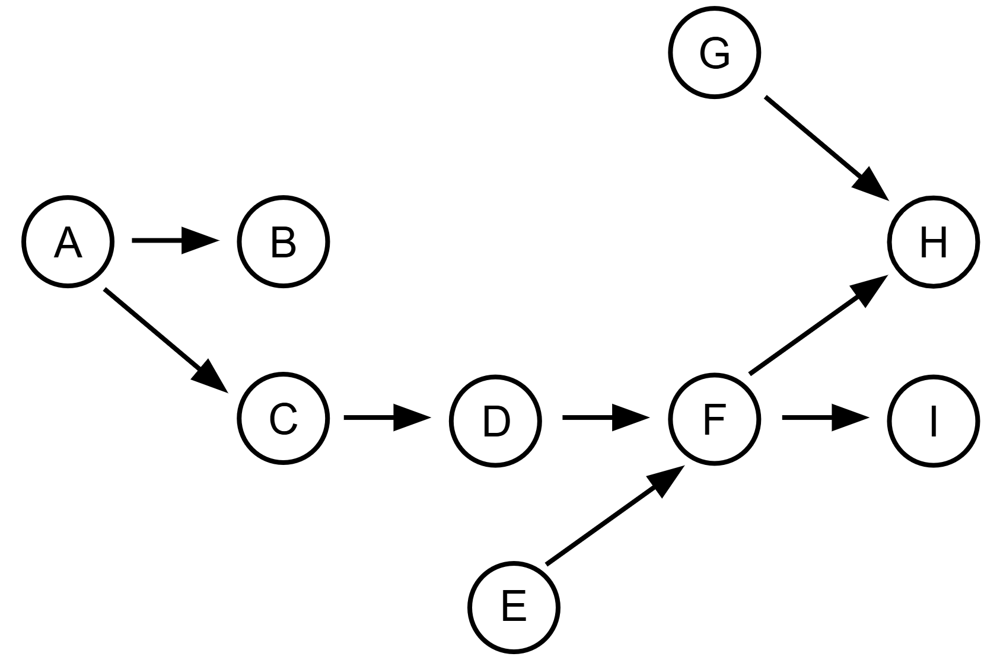
</div>

</div>


---
layout: center
---

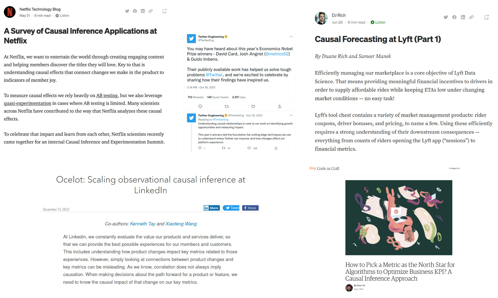


---

# Learning Objectives

By the end of this tutorial, you should be able to:
<br><br>

* • Understand the pitfalls of observational data analysis
* • Know the key types of causal relationships
* • Understand AI/ML vs causal inference vs and experiments
* • Start conducting preliminary causal analyses
* • Confidently explore the topic on your own 


---
layout: center
---

<div class="flex justify-center items-center h-screen">
<div id="vacationer-plot"></div>
</div>

<script setup>
import { onMounted } from 'vue'

onMounted(() => {
  // Load D3 from CDN
  const script = document.createElement('script')
  script.src = 'https://d3js.org/d3.v7.min.js'
  script.onload = () => {
    // Generate data similar to the original plot
    const generateData = () => {
      const data = []
      const n = 100

      for (let i = 0; i < n; i++) {
        const price = Math.random() * 100 + 10
        const baseBookings = 50 + price * 0.35
        const noise = (Math.random() - 0.5) * 50

        // Create the characteristic pattern
        //const distanceFromCenter = Math.abs(price - 45)
        const verticalSpread = 30 //+ distanceFromCenter * 1
        const verticalNoise = (Math.random() - 0.5) * verticalSpread * 2.5

        const bookings = Math.max(20, Math.min(120, baseBookings + verticalNoise))
        data.push({ price, bookings })
      }
      return data
    }

    const data = generateData()

    // Set up dimensions
    const margin = { top: 20, right: 30, bottom: 50, left: 60 }
    const width = 800 - margin.left - margin.right
    const height = 500 - margin.top - margin.bottom

    // Create SVG
    const svg = window.d3.select('#vacationer-plot')
      .append('svg')
      .attr('width', width + margin.left + margin.right)
      .attr('height', height + margin.top + margin.bottom)
      .append('g')
      .attr('transform', `translate(${margin.left},${margin.top})`)

    // Set up scales
    const xScale = window.d3.scaleLinear()
      .domain([10, 80])
      .range([0, width])

    const yScale = window.d3.scaleLinear()
      .domain([20, 120])
      .range([height, 0])

    // Add scatter points
    svg.selectAll('circle')
      .data(data)
      .enter()
      .append('circle')
      .attr('cx', d => xScale(d.price))
      .attr('cy', d => yScale(d.bookings))
      .attr('r', 3)
      .attr('fill', 'steelblue')
      .attr('opacity', 0.6)

    // Calculate linear regression for trendline
    const xMean = window.d3.mean(data, d => d.price)
    const yMean = window.d3.mean(data, d => d.bookings)

    let numerator = 0
    let denominator = 0

    data.forEach(d => {
      numerator += (d.price - xMean) * (d.bookings - yMean)
      denominator += (d.price - xMean) ** 2
    })

    const slope = numerator / denominator
    const intercept = yMean - slope * xMean

    // Add trendline
    const trendlineData = [
      { price: 10, bookings: slope * 10 + intercept },
      { price: 80, bookings: slope * 80 + intercept }
    ]

    svg.append('line')
      .attr('x1', xScale(trendlineData[0].price))
      .attr('y1', yScale(trendlineData[0].bookings))
      .attr('x2', xScale(trendlineData[1].price))
      .attr('y2', yScale(trendlineData[1].bookings))
      .attr('stroke', '#666')
      .attr('stroke-width', 2)

    // Add X axis
    svg.append('g')
      .attr('transform', `translate(0,${height})`)
      .call(window.d3.axisBottom(xScale))
      .append('text')
      .attr('x', width / 2)
      .attr('y', 40)
      .attr('fill', 'black')
      .style('font-size', '14px')
      .text('Price (USD)')

    // Add Y axis
    svg.append('g')
      .call(window.d3.axisLeft(yScale))
      .append('text')
      .attr('transform', 'rotate(-90)')
      .attr('x', -height / 2)
      .attr('y', -45)
      .attr('fill', 'black')
      .style('font-size', '14px')
      .text('Bookings Each Week')
  }
  document.head.appendChild(script)
})
</script>


---

# Is this plot useful? 🏖️


As a vacationer looking to avoid a crowded hotel? This is fine 👍
<br><br>
As a hotel owner trying to optimize your pricing with this plot is useless ❌ 


---
layout: two-cols
---


::right::


---
layout: center
---


---
layout: center
---

Does exposure to this radium clock cause cancer? 


---
layout: center
---

# … what happens in an alternative universe?

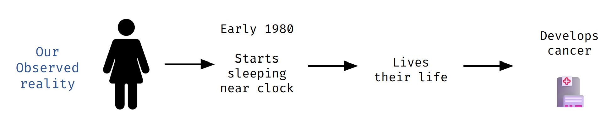


---
layout: center
---

# … what happens in an alternative universe?


---
layout: center
---

# Counterfactuals (“Counter to fact”)


---

# Counterfactuals

You can also think of counterfactuals as a **missing data problem**

| ID# | special offer | age | device  | churn? |
|-----|---------------|-----|---------|--------|
| 1   | Y             | 40  | iphone  | Y      |
| 2   | Y             | 35  | android | N      |
| 3   | N             | 77  | iphone  | N      |
| 4   | Y             | 18  | android | N      |

---


| ID# | Observed? | special offer | age | device  | churn? |
|-----|-----------|---------------|-----|---------|--------|
| 1   | ✓         | Y             | 40  | iphone  | Y      |
| 1   | ✗         | N             | 40  | iphone  | ???    |
| 2   | ✓         | Y             | 35  | android | N      |
| 2   | ✗         | N             | 35  | android | ???    |
| 3   | ✗         | Y             | 77  | iphone  | ???    |
| 3   | ✓         | N             | 77  | iphone  | N      |
| 4   | ✓         | Y             | 18  | android | N      |
| 4   | ✗         | N             | 18  | android | ???    |


---

# Experiments / A/B Tests / Randomized Controlled Trials

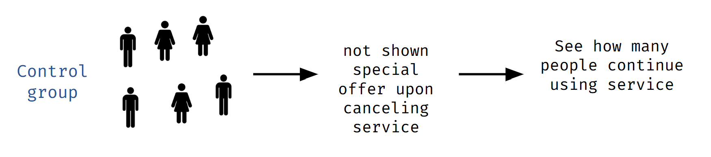


---

# Experiments / A/B Tests / Randomized Controlled Trials

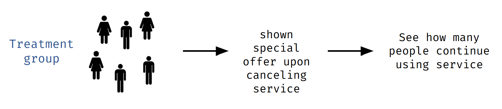


---

# When Experiments Aren't Feasible

- • Understanding how a user's behavior changes when they switch from an iPhone to the newest Samsung phone
- • Too few units, such as in a Merger and Acquisition scenario (there is one event that may or may not happen)
- • Modify household incomes in neighborhoods, to see if reducing a neighborhood's income inequality reduces the local crime rate

---

# When Experiments Aren't Ethical

- • Randomly assign some people to be exposed to lead paint while others are not, then see which group is more likely to develop neurological disorders
- • Assigning some social media users to receive more psychologically dark posts to understand how it impacts engagement


---

# The Hierarchy of Evidence

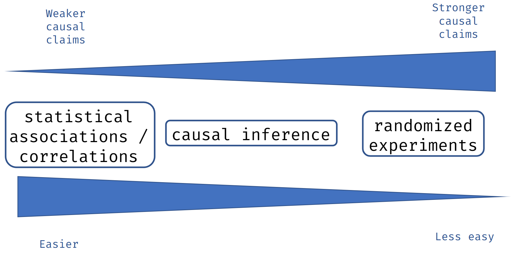


---

# Important Note on Correlations


I'm referring to **RAW associations and correlations**. Calculating correlations is **indispensable** in causal inference work, but we make intelligent adjustments to make them useful.


---
layout: two-cols
---


# Causal Inference Questions

- • How does improving neighborhood income inequality **reduce** neighborhood crime rate?
- • How does **increasing or decreasing** the price of a product impact demand?
- • What would be the **impact** on diabetes if we reduced average sugar consumption by X grams?


::right::

# Standard ML Questions
<br>

- • Can I **cluster** neighborhoods by their characteristics?
- • Can I **predict** whether someone will convert from a lead to a customer?
- • How well can I **predict** whether a patient will be diagnosed with diabetes later in life?


---

# A Causal Graph (DAG)

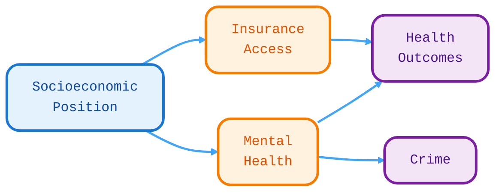

<div class="text-center mt-8">
Directed Acyclic Graphs (DAGs) help us visualize causal relationships
</div>


---
layout: center
class: text-center
---

# Exercise Time! 🎯

Let's practice drawing causal graphs

---
layout: two-cols
---

# Car Insurance and causality

- Make & model
- Theft history
- Car value
- Advanced airbag
- Antilock brakes
- Driving course completion
- Vehicle year

:: right :: 
<br><br><br><br><br>
- Car safety rating
- Accident history
- Age
- Medical cost of accident
- Good student status
- Risk aversion


---
layout: center
class: text-center
---

# Three Important Types of Causal Relationships

---

# 1) Confounders


<div class="mt-8">

- • Always want to **control for** confounders in inferential modeling
- • Confounding changes the effect size and possibly statistical significance
- • Confounders can also **flip the direction** of your association of interest
- • Leftover confounding is called "residual confounding"

</div>

---

# Confounding Example: AirBnB


<div class="mt-8">

**Tourism demand** is a confounder:
- • It increases AirBnB presence
- • It increases house prices
- • Creates a spurious association between AirBnB and prices

</div>

---

# Types of Confounding

<div class="grid grid-cols-2 gap-8 mt-8">

<div>

### Positive Confounding
Confounder introduces a bias that pushes association **away from zero**

</div>

<div>

### Negative Confounding
Confounder biases association **towards the zero**

</div>

</div>

---

# Classic Example: Ice Cream & Crime

<div class="text-center mt-8">
Do ice cream sales cause violent crime? 🍦 → 🔫
</div>

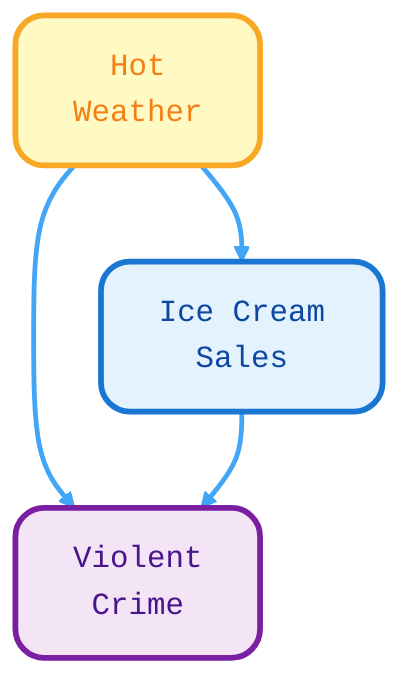


---

# Controlling for Confounders

After controlling for season/weather, the ice cream-crime association disappears!

<div class="mt-8">

### How do we "control" for things?

**Option 1: Stratification (simple/naive way)**
- • Filter your dataset so the confounder only takes on 1 value
- • Example: `p(lung problems = 1 | smoker = 0)`

**Option 2: Use a model!**
- • We'll go deep on this in the second half of the tutorial

</div>

---

# How Experiments Break Confounding


<div class="mt-8">

In experiments, **randomization breaks** the association between confounders and treatment!

The randomization ensures classroom size is independent of socioeconomic status.

</div>

---

# Key Insight

<div class="text-center mt-8">

**Experiments** are wonderful because randomization breaks all confounding

**Causal inference** is when we take non-experimental (observational) data and carefully try to pick apart the confounding ourselves

</div>

---

# 2) Colliders

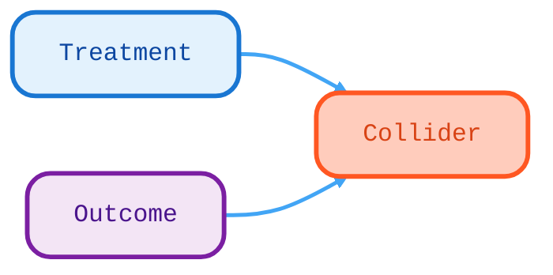

<div class="mt-8">

**Key points:**
- • **Never** want to control for colliders!
- • Conditioning on a common effect causes **collider bias**
- • Can bias results in positive or negative direction

</div>

---

# Collider Example: Sick Days

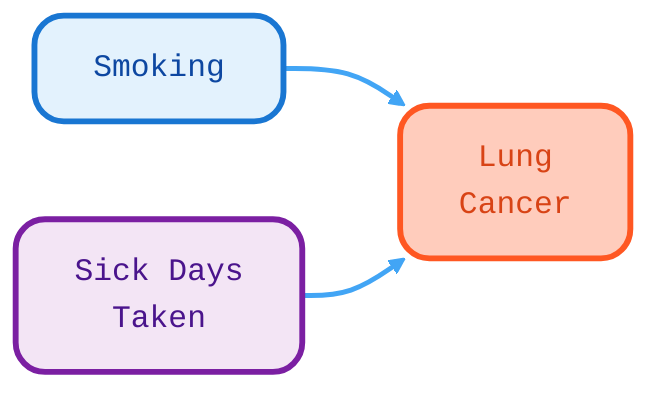

<div class="mt-8">

If you control for lung cancer (the collider), you'll create a spurious association between smoking and sick days taken!

This is called **collider bias** or **selection bias**

</div>

---

# 3) Mediators


<div class="mt-8">

**Key points:**
- • Controlling for a mediator will **nullify** associations of interest
- • There are statistical tests of mediation you can use
- • Helps determine causal pathways in observational data

</div>

---

# Mediator Example: Rideshare


<div class="mt-8">

If you control for rideshare requests (the mediator), you'll eliminate the effect of rain on profit!

The requests ARE the mechanism by which rain affects profit.

</div>

---

# Putting It All Together

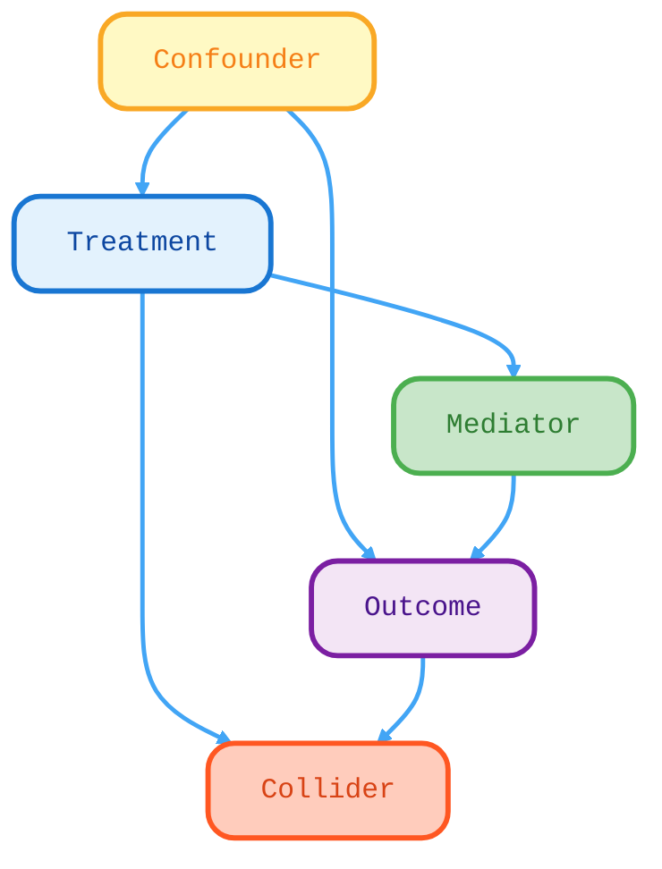

<div class="text-center mt-8">
✅ Control for confounders<br/>
❌ Don't control for colliders<br/>
⚠️ Be careful with mediators
</div>

---

# Reality is Complicated!

<div class="text-center">

Real-world causal graphs can be extremely complex

</div>

<div class="text-xs text-gray-500 mt-8">
Hamra GB et al., "Model Averaging for Improving Inference from Causal Diagrams", 2015
</div>

---
layout: center
class: text-center
---

# Notebook Exercise #1

### Causal Graphs

Time to practice! 🚀

---

# Important Asides

---

# Avoid Automated Causal Discovery

<div class="mt-8">

**Markov Equivalence Classes**

These three graphs are indistinguishable with observational data:

</div>


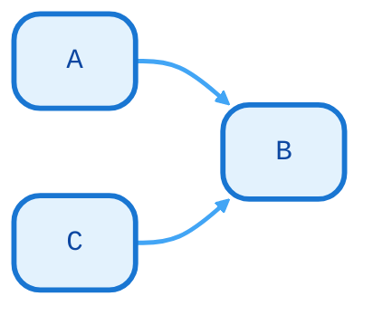


---

# Avoid Automated Causal Discovery (cont.)

<div class="mt-8">

❌ Don't rely on automated causal graph structure learning algorithms

✅ Stick with good domain knowledge

</div>

<div class="mt-8">
Understanding your domain and the data-generating process is crucial for building accurate causal models.
</div>

---

# LLMs and Causality

<div class="mt-8">

**Research Question:** Can Large Language Models Infer Causation from Correlation?

**Authors:** Zhijing Jin et al. (2024)

**Key Finding:** Current LLMs struggle with pure causal inference tasks, even though they may have seen causal facts in their training data.

</div>

<div class="text-xs text-gray-500 mt-8">
Jin et al., Max Planck Institute, ETH Zürich, University of Michigan, Meta AI
</div>

---

# LLMs and Causality: The Task

<div class="grid grid-cols-2 gap-8">

<div>

**Training Corpus Contains:**
- • "Smoking causes cancer" ✓ Clear causal fact
- • "Upon the release of vaccines, disease cases reached a historical high"

**New Task: Corr2Cause Inference**
- • Suppose A correlates with B. Can we infer A causes B?
- • A correlates with C. B correlates with C. However, A is independent of B. Can we infer A and B have a common effect?

</div>

<div>

**Previous Tasks:**
- • "Alice slipped, so she fell down" → Plausible

**Skill tested in previous work:**
Empirical knowledge, not pure causal inference

**This requires:**
Inferring causation from correlation

</div>

</div>

---

# LLMs and Causality: Performance

<div class="text-sm">

| Model | F1 | Accuracy |
|-------|-----|----------|
| **Random Baselines** | | |
| Always Majority | 0.0 | 84.77 |
| Random (Uniform) | 20.38 | 62.78 |
| **BERT-Based Models** | | |
| BART MNLI | 33.38 | 78.50 |
| **LLaMa-Based Models** | | |
| Alpaca-6.7B | 27.37 | 21.33 |
| **GPT-Based Models** | | |
| GPT-3 Davinci | 27.82 | 31.61 |
| GPT-3.5 | 21.69 | 69.46 |
| GPT-4 | **29.08** | 64.60 |

</div>

<div class="text-center mt-8">
**Even GPT-4 struggles with pure causal inference from correlational statements!**
</div>

---

# LLMs and Causality: Fine-tuning Helps

<div class="text-sm">

| Model | F1 (Original) | F1 (Finetuned) | Improvement |
|-------|---------------|----------------|-------------|
| GPT-3 Ada | 0.0 | 79.85 | ✓ |
| GPT-3 Davinci | 27.82 | **85.52** | ✓ |
| BERT-Large | - | 85.26 | ✓ |
| RoBERTa-Large | - | 89.10 | ✓ |
| RoBERTa-Large MNLI | - | **94.74** | ✓ |

</div>

<div class="mt-8">
Fine-tuning dramatically improves performance, but models still struggle with:
- • Paraphrased statements
- • Variable refactorization
</div>

---

# Variable Importance ≠ Causality

<div class="text-center mt-8">

**⚠️ Traditional variable importance methods don't tell you anything about causality!**

</div>

<div class="mt-8">

**Examples of non-causal importance measures:**
- • SHAP values
- • Feature importances from Random Forests
- • Correlation coefficients
- • Regression coefficients (without proper causal adjustment)

**These tools are useful for prediction, but not for causal inference!**

</div>

---

# Transitioning to Causal Modeling

<div class="mt-8">

We've discussed three types of causal relationships.

Going forward, we're going to assume you identified key **confounders** you want to control for, as you estimate the causal impact between a **"treatment"** and an **"outcome"**...

</div>

---

# If You Are Doing Causal Modeling...

<div class="mt-8">

**Best Practices:**

1. **Think before looking at data** - Carefully consider quantities of interest and their relationships using domain knowledge

2. **Stick with a small set of important variables** - Only include variables you have domain knowledge about

3. **Understand bivariate relationships** - Before modeling, examine relationships between:
   - • Independent variables with each other
   - • Independent variables with dependent variable

4. **Identify potential confounders** - Clearly identify covariates to control for and those NOT to control for

</div>

---

# Assumptions of Causal Inference

<div class="mt-8">

**Four Key Assumptions:**

1. **Temporality** - Causes always occur before effects. Treatment must occur before measured outcome. Covariates should occur before treatment.

2. **SUTVA (Stable Unit Treatment Value)** - The treatment status of one individual does not affect the potential outcomes of any other individuals.

3. **Positivity** - For each level of each covariate, there needs to be some variability in treatment and outcome variables.

4. **Ignorability** - All major confounding variables are included in your data. This is tough but necessary for unbiased treatment effect estimates.

</div>

---

# Assumption Violations: Example #1

**Temporality Violation**

<div class="mt-8">

**Scenario:** I want to understand whether frequent emails to customers might impact customer satisfaction.

I have survey data with customer self-reported satisfaction from a year ago, and I use this past month's number of emails for each customer as a proxy for how often we email them generally.

**⚠️ Problem:** Past satisfaction cannot be caused by future emails! Temporal ordering is violated.

</div>

---

# Assumption Violations: Example #2

**Positivity Violation**

<div class="mt-8">

**Scenario:** I want to see the causal impact of a neighborhood's cleanliness on crime rates, controlling for 20 known confounders.

I pull up an academic dataset with data on 40 distinct neighborhoods. So, my sample size is 40.

**⚠️ Problem:** 20 covariates with only 40 observations! Severe overfitting risk and positivity violations are likely.

</div>

---

# Assumption Violations: Example #3

**SUTVA Violation**

<div class="mt-8">

**Scenario:** I want to see how releasing a new in-app, multiplayer game through my social media app impacts user engagement. I only want to give it to some test users initially.

With this multiplayer game you can play with anyone who has the social media app by sending them invites. Accidentally, our test users can invite non-test users.

**⚠️ Problem:** Treatment spillover! Test users affect control users through invites, violating independence.

</div>

---

# Assumption Violations: Example #4

**Ignorability Violation**

<div class="mt-8">

**Scenario:** We're curious how a job training program could impact a person's income 3 years in the future.

Unfortunately we don't have lots of data on the participants so we perform a causal inference analysis only controlling for the person's age.

**⚠️ Problem:** Massive residual confounding! Education, work history, location, industry, etc. are all missing.

</div>

---

# Metrics for Causal Effects

---

# Counterfactuals with Binary Treatment

<div class="grid grid-cols-2 gap-8 mt-8">

<div>

### Observed Reality
Experiences 500ms delay on website

**Click-through rate: 15%**

</div>

<div>

### Alternative Reality
Experiences no delay on website

**Click-through rate: 20%**

</div>

</div>

<div class="text-center mt-8">
Average Treatment Effect = 20% - 15% = **+5%**
</div>

---

# Important Note on Units of Analysis

<div class="mt-8">

You can apply causal inference to **any unit of analysis**:

- • People
- • Browser sessions
- • Webpages
- • Clusters of friends (social media data)
- • Neighborhoods
- • Buildings
- • Pharmacies
- • etc.

</div>

---

# Common Causal Metrics

| Metric | Population |
|--------|-----------|
| **ATE** - Average Treatment Effect | Effect in entire population |
| **ATT** - Average Treatment Effect Among Treated | Effect in treated population |
| **ATU** - Average Treatment Effect Among Untreated | Effect in untreated population |
| **ITE** - Individual Treatment Effect | Effect for a single unit |

---

# Conditional Causal Metrics

| Metric | Population |
|--------|-----------|
| **CATE** - Conditional Average Treatment Effect | Effect segmented by some covariate |
| **CATT** - Conditional ATT | Effect in treated, segmented by covariate |
| **CATU** - Conditional ATU | Effect in untreated, segmented by covariate |

---

# Modeling Approaches for Causal Inference

---

# Interrupted Time Series

<div class="mt-8">
Used when a policy or intervention occurs at a specific time point
</div>

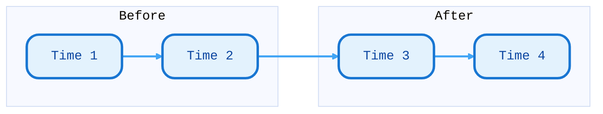

<div class="mt-8">

**Key Idea:** Compare the trend before intervention to the trend after intervention

**Example:** Impact of a new law on crime rates

</div>

---

# Regression Discontinuity Design

<div class="mt-8">
Used when treatment assignment is based on a threshold/cutoff
</div>

<div class="text-center mt-8">

**Example:** Poverty Index cutoff at 58

- • If Poverty Index < 58: Eligible for assistance
- • If Poverty Index ≥ 58: Not eligible

</div>

<div class="mt-8">

**Key Idea:** Compare outcomes just above and below the threshold

**Assumption:** Units just above/below cutoff are similar except for treatment

</div>

---

# Difference in Differences

<div class="mt-8">
Used when you have pre/post data for both treatment and control groups
</div>

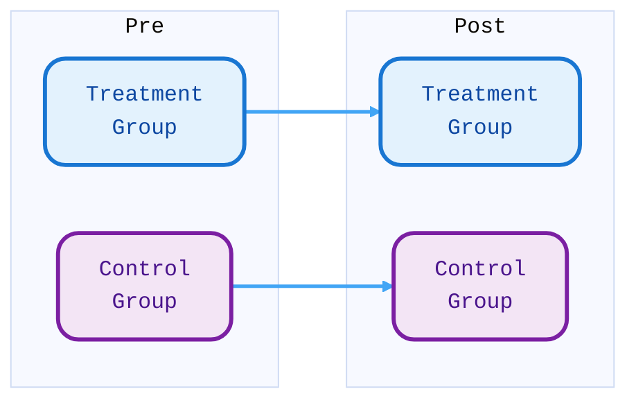

<div class="mt-8">

**Key Idea:** (Treatment_post - Treatment_pre) - (Control_post - Control_pre)

**Assumption:** Parallel trends - both groups would have changed similarly without treatment

</div>

---

# Propensity Score Matching (PSM)

<div class="text-center">

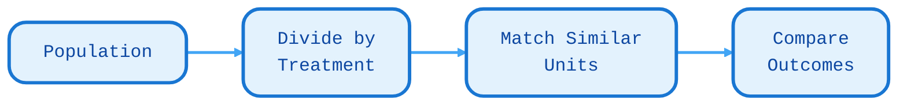

</div>

**Process:**
1. Calculate probability of receiving treatment for each unit
2. Match treated units with similar untreated units
3. Compare outcomes between matched pairs

---

# PSM Step 1: Start with Data

| ID# | Covar 1 | Covar 2 | treat | outcome |
|-----|---------|---------|-------|---------|
| 1   | ...     | ...     | 1     | 20      |
| 2   | ...     | ...     | 1     | 15      |
| 3   | ...     | ...     | 0     | 10      |
| 4   | ...     | ...     | 0     | 10      |
| 5   | ...     | ...     | 1     | 20      |

---

# PSM Step 2: Calculate Propensity Scores

| ID# | Covar 1 | Covar 2 | treat | **ps** | outcome |
|-----|---------|---------|-------|--------|---------|
| 1   | ...     | ...     | 1     | **0.65** | 20    |
| 2   | ...     | ...     | 1     | **0.33** | 15    |
| 3   | ...     | ...     | 0     | **0.64** | 10    |
| 4   | ...     | ...     | 0     | **0.33** | 10    |
| 5   | ...     | ...     | 1     | **0.97** | 20    |

Use a model to predict `treat` from covariates

---

# PSM Step 3: Match Units

<div class="grid grid-cols-2 gap-4">

<div>

### Match 1
| ID# | treat | ps | outcome |
|-----|-------|-----|---------|
| 1   | 1     | 0.65 | 20     |
| 3   | 0     | 0.64 | 10     |

</div>

<div>

### Match 2
| ID# | treat | ps | outcome |
|-----|-------|-----|---------|
| 2   | 1     | 0.33 | 15     |
| 4   | 0     | 0.33 | 10     |

</div>

</div>

<div class="text-center mt-8">
Match based on similar propensity scores!
</div>

---

# PSM Step 4: Calculate Effect

| ID# | treat | outcome |
|-----|-------|---------|
| 1   | 1     | 20      |
| 2   | 1     | 15      |
| 3   | 0     | 10      |
| 4   | 0     | 10      |

<div class="text-center mt-8">
Average Treatment Effect = (20 + 15)/2 - (10 + 10)/2 = **7.5**
</div>

---

# G-Computation / S-Learner

An ML-based approach to causal inference

**Key idea:** Train a model to predict outcomes, then simulate counterfactuals

---

# G-Computation Step 1: Train Model

| ID# | Covar 1 | Covar 2 | treat | outcome |
|-----|---------|---------|-------|---------|
| 1   | ...     | ...     | 1     | 20      |
| 2   | ...     | ...     | 1     | 15      |
| 3   | ...     | ...     | 0     | 10      |
| 4   | ...     | ...     | 0     | 10      |
| 5   | ...     | ...     | 1     | 20      |

Train a model: `outcome ~ covariates + treat`

Aim for high recall and precision!

---

# G-Computation Step 2: Force Treatment = 1

| ID# | Covar 1 | Covar 2 | treat | outcome | **ŷ(treat=1)** |
|-----|---------|---------|-------|---------|----------------|
| 1   | ...     | ...     | **1** | 20      | **22.5**       |
| 2   | ...     | ...     | **1** | 15      | **16.0**       |
| 3   | ...     | ...     | **1** | 10      | **14.0**       |
| 4   | ...     | ...     | **1** | 10      | **17.0**       |
| 5   | ...     | ...     | **1** | 20      | **22.5**       |

Predict outcomes when everyone is treated

---

# G-Computation Step 3: Force Treatment = 0

| ID# | ŷ(treat=1) | **ŷ(treat=0)** | **CATE** |
|-----|------------|----------------|----------|
| 1   | 22.5       | **18.5**       | **4.0**  |
| 2   | 16.0       | **14.0**       | **2.0**  |
| 3   | 14.0       | **11.5**       | **2.5**  |
| 4   | 17.0       | **13.0**       | **4.0**  |
| 5   | 22.5       | **19.5**       | **3.0**  |

<div class="text-center mt-8">
Average CATE = **3.1**
</div>

---
layout: center
class: text-center
---

# Notebook Exercise #2

### Implementing G-Computation

Time to code! 💻

---

# Continuous Treatments

What if treatment isn't binary?

**Example:** How does the *amount* of advertising spending affect sales?

We need to estimate the **causal dose-response curve**

---

# Causal Dose-Response Curves

<div class="text-center">

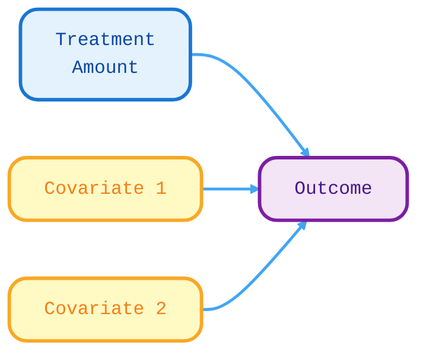

</div>

Instead of just two counterfactuals (treated/untreated), we have infinite counterfactuals along a continuous range!

---

# Visualizing Dose-Response

<div class="text-center mt-8">

**Outcome**

↑

|           /
|         /
|       /
|     /
|   /
| /
+----------→ **Treatment**

</div>

The curve shows how outcome changes across different treatment levels

---
layout: center
class: text-center
---

# Notebook Exercise #3

### Dose-Response Curve Estimation

Let's estimate causal curves! 📈

---

# A Simple Causal Inference Flowchart

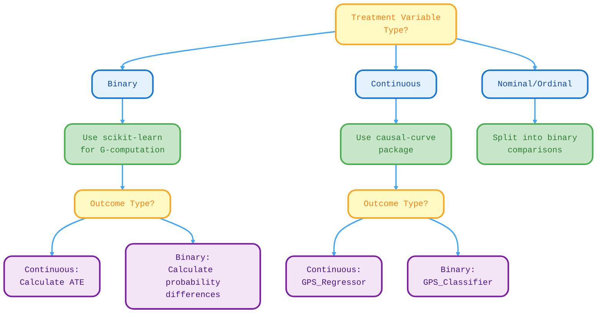

---

# Closing Thoughts

---

# The Perils of Multiple Testing

<div class="mt-8">

Running many statistical tests inflates your false positive rate!

**Solutions:**
- • Use p-value correction (Bonferroni, FDR)
- • Pre-register your hypotheses
- • Be transparent about exploratory vs. confirmatory analyses

</div>

---

# Be Humble!

<div class="text-center mt-8">

It's likely your research or business idea doesn't work!

That's okay - **null results are still valuable results**

</div>

---

# Troubleshooting Tips

- • Having **domain knowledge** and understanding the data-generating process is often way more productive than just throwing an algo at the problem
- • There is value in trying **multiple techniques** to understand their range of estimates (but use p-value correction!)
- • You'll **never capture all confounders**, but do aim to capture the major ones
- • If your results don't make sense and your code isn't buggy, you're probably **missing a big source of bias**
- • Causal inference is powerful but **still not as trustworthy as running a proper experiment**. Approach all results with healthy skepticism.

---
layout: center
class: text-center
---

# Thank You! 🎉

### Questions?

<div class="mt-8">

**Resources:**
- • GitHub: [your-repo-link]
- • Marimo Notebooks: [notebook-links]
- • Further Reading: Pearl's "The Book of Why"

</div>

---
layout: center
class: text-center
---

# Let's Practice!

Open the Marimo notebooks and let's get hands-on with causal inference! 🚀

```bash
cd notebooks
uv run marimo edit 01_causal_graphs.py
```
