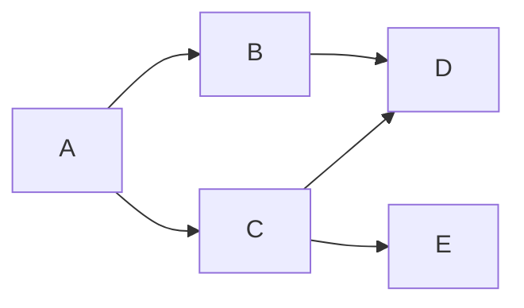
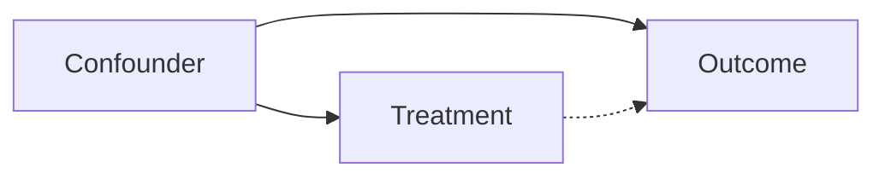
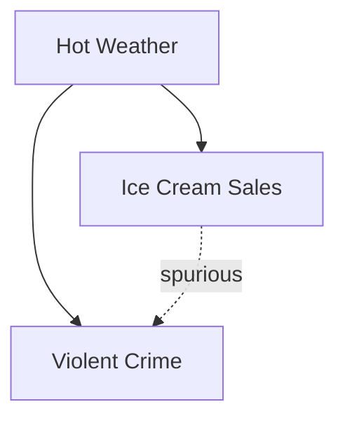
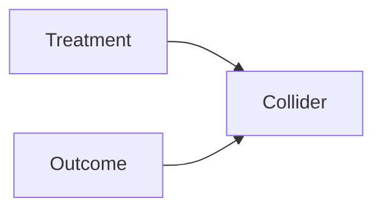
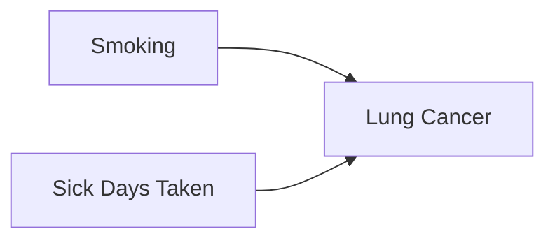
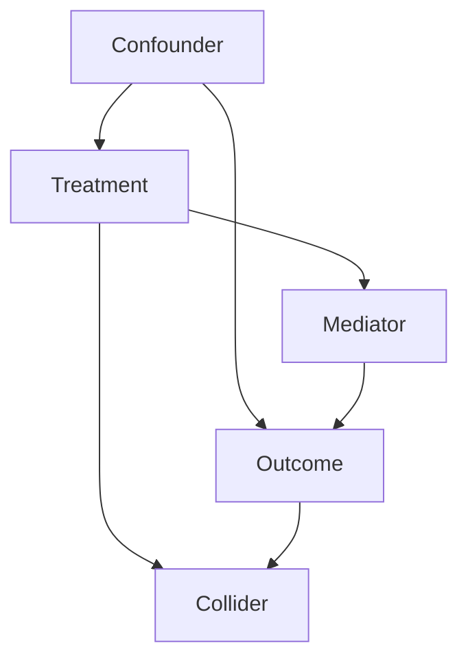
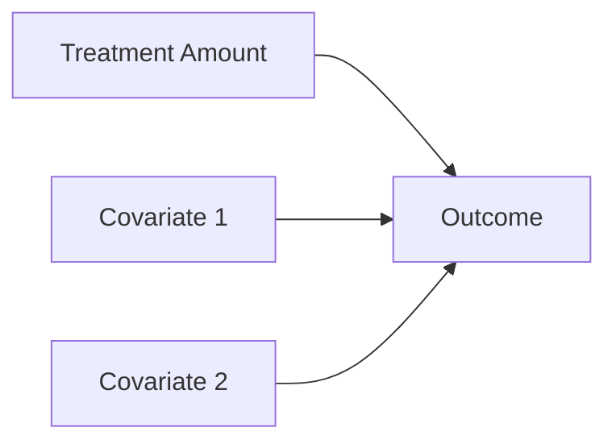
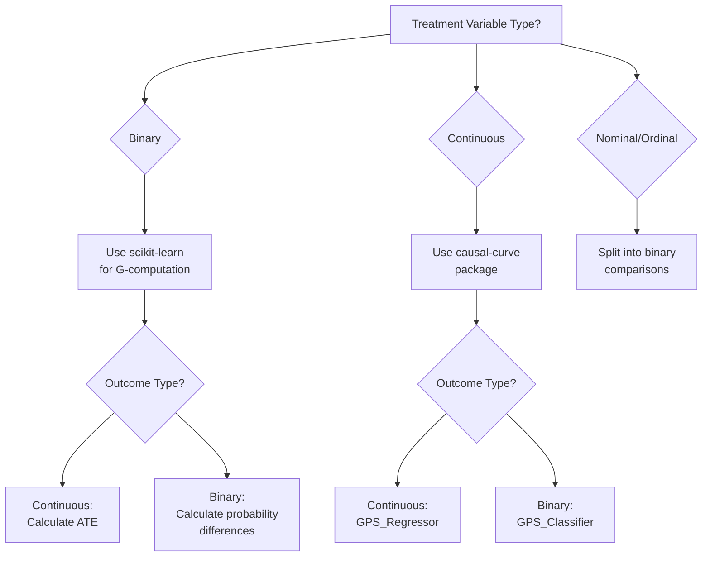

# Introduction to Causal Inference

SciPy 2026

**Roni Kobrosly Ph.D.**

<div class="pt-12">
  <span @click="$slidev.nav.next" class="px-2 py-1 rounded cursor-pointer" hover="bg-white bg-opacity-10">
    Press Space to begin <carbon:arrow-right class="inline"/>
  </span>
</div>

---

# Learning Objectives

By the end of this tutorial, you should be able to:

- Understand the pitfalls of observational data analysis
- Know the various types of causal relationships to look out for
- Describe the hierarchy of statistical analyses, causal inference, and experiments
- Start conducting preliminary causal analyses on your own data
- Confidently explore the topic on your own (now that you have a solid foundational understanding of causal thinking)

---
layout: two-cols
---

# Hotel Prices Example

## As a Vacationer 🏖️

Looking to avoid a crowded hotel: this plot is good enough 👍

::right::

## As a Hotel Owner 🏨

Trying to optimize your pricing: this plot is useless…

<div class="text-center mt-8">

**Correlation ≠ Causation**

</div>

---

# The Radium Clock Question

<div class="text-4xl text-center my-20">

Does exposure to this radium clock cause cancer?

</div>

---

# Alternative Universes

<div class="grid grid-cols-2 gap-4">

<div>

### Our Observed Reality
**Early 1980**

1. Starts sleeping near clock
2. Develops cancer 🏥

</div>

<div>

### An Alternative Reality
**Early 1980**

1. Throws out clock upon discovery
2. Does not develop cancer 😄

</div>

</div>

<div class="text-center mt-8 text-xl">

This is the essence of **counterfactual thinking**

</div>

---

# Counterfactuals

## "Counter to fact"

You can also think of counterfactuals as a **missing data problem**

| ID# | special offer | age | device  | churn? |
|-----|---------------|-----|---------|--------|
| 1   | Y             | 40  | iphone  | Y      |
| 2   | Y             | 35  | android | N      |
| 3   | N             | 77  | iphone  | N      |
| 4   | Y             | 18  | android | N      |

---

# The Missing Data Problem

| ID# | Observed? | special offer | age | device  | churn? |
|-----|-----------|---------------|-----|---------|--------|
| 1   | ✓         | Y             | 40  | iphone  | Y      |
| 1   | ✗         | N             | 40  | iphone  | ???    |
| 2   | ✓         | Y             | 35  | android | N      |
| 2   | ✗         | N             | 35  | android | ???    |
| 3   | ✗         | Y             | 77  | iphone  | ???    |
| 3   | ✓         | N             | 77  | iphone  | N      |
| 4   | ✓         | Y             | 18  | android | N      |
| 4   | ✗         | N             | 18  | android | ???    |

<div class="text-center text-red-500 font-bold mt-4">
We can never observe both outcomes for the same unit!
</div>

---

# Experiments (Randomized Controlled Trials)

## Also known as A/B Tests

<div class="grid grid-cols-2 gap-8 mt-8">

<div class="text-center">

### Treatment Group
Shown special offer upon canceling service

</div>

<div class="text-center">

### Control Group
Not shown special offer upon canceling service

</div>

</div>

<div class="text-center mt-12">

**Compare outcomes between the two groups**

</div>

---

# When Experiments Aren't Feasible

Examples:

- Understanding how a user's behavior changes when they switch from an iPhone to the newest Samsung phone
- Too few units, such as in a Merger and Acquisition scenario (there is one event that may or may not happen)
- Modify household incomes in neighborhoods, to see if reducing a neighborhood's income inequality reduces the local crime rate

<div class="text-xs text-gray-500 mt-8">
Kohavi et al. "Trustworthy Online Controlled Experiments." 2020
</div>

---

# When Experiments Aren't Ethical

Examples:

- Randomly assign some people to be exposed to lead paint while others are not, then see which group is more likely to develop neurological disorders
- Assigning some social media users to receive more psychologically dark posts to understand how it impacts engagement

<div class="text-center text-red-500 font-bold mt-12">
This is where causal inference becomes essential!
</div>

---

# The Hierarchy of Evidence

<div class="grid grid-cols-3 gap-4 mt-12">

<div class="text-center">

## Statistical Associations

**Correlations**

<div class="text-sm mt-4">
Weaker causal claims
<br/>
Easier to obtain
</div>

</div>

<div class="text-center">

## Causal Inference

**Observational Analysis**

<div class="text-sm mt-4">
Moderate causal claims
<br/>
Less easy
</div>

</div>

<div class="text-center">

## Experiments

**RCTs / A/B Tests**

<div class="text-sm mt-4">
Stronger causal claims
<br/>
Hardest to conduct
</div>

</div>

</div>

---

# Important Note on Correlations

<div class="text-xl mt-8">

I'm referring to **RAW associations and correlations**.

Correlations are **indispensable** in causal inference work, but we make intelligent adjustments to make them more valuable.

</div>

---

# Causal Inference vs Typical ML

<div class="grid grid-cols-2 gap-8">

<div>

## Causal Inference Questions

- How does improving neighborhood income inequality **reduce** neighborhood crime rate?
- How does **increasing or decreasing** the price of a product impact demand?
- What would be the **impact** on diabetes if we reduced average sugar consumption by X grams?

</div>

<div>

## Typical ML Questions

- Can I **cluster** neighborhoods by their characteristics?
- Can I **predict** whether someone will convert from a lead to a customer?
- How well can I **predict** whether a patient will be diagnosed with diabetes later in life?

</div>

</div>

---

# A Causal Graph (DAG)


```mermaid
graph LR
    A --> B
    A --> C
    B --> D
    C --> D
    C --> E
```

<div class="text-center mt-8">
Directed Acyclic Graphs (DAGs) help us visualize causal relationships
</div>

---
layout: center
class: text-center
---

# Exercise Time! 🎯

Let's practice drawing causal graphs

---

# Car Insurance Example

Variables to consider:
- Make & model
- Theft history
- Car value
- Advanced airbag
- Antilock brakes
- Driving course completion
- Vehicle year
- Car safety rating
- Accident history
- Age
- Medical cost of accident
- Good student status
- Risk aversion

<div class="text-center mt-8">
How are these causally related?
</div>

---
layout: center
class: text-center
---

# Three Important Types of Causal Relationships

---

# 1) Confounders


```mermaid
graph LR
    C[Confounder] --> T[Treatment]
    C --> O[Outcome]
    T -.-> O
```

<div class="mt-8">

**Key points:**
- Always want to **control for** confounders in inferential modeling
- Confounding changes the effect size and possibly statistical significance
- Confounders can also **flip the direction** of your association of interest
- Leftover confounding is called "residual confounding"

</div>

---

# Confounding Example: AirBnB


```mermaid
graph LR
    TD[Tourism Demand] --> AB[Presence of AirBnB]
    TD --> HP[House Prices]
    AB -.-> HP
```

<div class="mt-8">

**Tourism demand** is a confounder:
- It increases AirBnB presence
- It increases house prices
- Creates a spurious association between AirBnB and prices

</div>

---

# Types of Confounding

<div class="grid grid-cols-2 gap-8 mt-8">

<div>

## Positive Confounding
Confounder introduces a bias that pushes association **away from the null**

</div>

<div>

## Negative Confounding
Confounder biases association **towards the null**

</div>

</div>

---

# Classic Example: Ice Cream & Crime

<div class="text-center text-2xl mb-8">
Do ice cream sales cause violent crime? 🍦 → 🔫
</div>


```mermaid
graph TD
    HW[Hot Weather] --> IC[Ice Cream Sales]
    HW --> VC[Violent Crime]
    IC -.spurious.-> VC
```

<div class="text-center mt-8">
**Hot weather** confounds the relationship!
</div>

---

# Controlling for Confounders

After controlling for season/weather, the ice cream-crime association disappears!

<div class="mt-12">

## How do we "control" for things?

**Option 1: Stratification (simple/naive way)**
- Filter your dataset so the confounder only takes on 1 value
- Example: `p(lung problems = 1 | smoker = 0)`

**Option 2: Use a model!**
- We'll go deep on this in the second half of the tutorial

</div>

---

# How Experiments Break Confounding


```mermaid
graph LR
    SES[Socioeconomic Status] --> CS[Classroom Size]
    SES -.-> SP[Student Performance]
    CS --> SP
```

<div class="mt-8">

In experiments, **randomization breaks** the association between confounders and treatment!

The randomization ensures classroom size is independent of socioeconomic status.

</div>

---

# Key Insight

<div class="text-2xl text-center my-20">

**Experiments** are wonderful because randomization breaks all confounding

**Causal inference** is when we take non-experimental (observational) data and carefully try to pick apart the confounding ourselves

</div>

---

# 2) Colliders


```mermaid
graph LR
    T[Treatment] --> C[Collider]
    O[Outcome] --> C
```

<div class="mt-8">

**Key points:**
- **Never** want to control for colliders!
- Conditioning on a common effect causes **collider bias**
- Can bias results in positive or negative direction

</div>

---

# Collider Example: Sick Days


```mermaid
graph LR
    S[Smoking] --> LC[Lung Cancer]
    SD[Sick Days Taken] --> LC
```

<div class="mt-8">

If you control for lung cancer (the collider), you'll create a spurious association between smoking and sick days taken!

This is called **collider bias** or **selection bias**

</div>

---

# 3) Mediators


```mermaid
graph LR
    T[Treatment] --> M[Mediator] --> O[Outcome]
```

<div class="mt-8">

**Key points:**
- Controlling for a mediator will **nullify** associations of interest
- There are statistical tests of mediation you can use
- Helps determine causal pathways in observational data

</div>

---

# Mediator Example: Rideshare


```mermaid
graph LR
    HR[Hours of Rain] --> RR[Rideshare Requests] --> DP[Daily Profit]
```

<div class="mt-8">

If you control for rideshare requests (the mediator), you'll eliminate the effect of rain on profit!

The requests ARE the mechanism by which rain affects profit.

</div>

---

# Putting It All Together


```mermaid
graph TD
    CF[Confounder] --> T[Treatment]
    CF --> O[Outcome]
    T --> M[Mediator]
    M --> O
    T --> CL[Collider]
    O --> CL
```

<div class="text-center mt-8 text-xl">
✅ Control for confounders<br/>
❌ Don't control for colliders<br/>
⚠️ Be careful with mediators
</div>

---

# Reality is Complicated!

<div class="text-center">

Real-world causal graphs can be extremely complex

</div>

<div class="text-xs text-gray-500 mt-8">
Hamra GB et al., "Model Averaging for Improving Inference from Causal Diagrams", 2015
</div>

---
layout: center
class: text-center
---

# Notebook Exercise #1

## Causal Graphs

Time to practice! 🚀

---

# Important Asides

---

# Avoid Automated Causal Discovery

<div class="text-xl mt-12">

❌ Don't rely on automated causal graph structure learning algorithms

✅ Stick with good domain knowledge

</div>

<div class="mt-12">
Understanding your domain and the data-generating process is crucial for building accurate causal models.
</div>

---

# Common Pitfalls - Example #1

**Problem:** Using proxies and lagged variables incorrectly

I want to understand whether frequent emails to customers might impact customer satisfaction.

I have survey data with customer self-reported satisfaction from a year ago, and I use this past month's number of emails for each customer as a proxy for how often we email them generally.

<div class="text-red-500 mt-8">
⚠️ Temporal ordering matters! Past satisfaction cannot be caused by future emails.
</div>

---

# Common Pitfalls - Example #2

**Problem:** Too many covariates, too little data

I want to see the causal impact of a neighborhood's cleanliness on crime rates, controlling for 20 known confounders.

I pull up an academic dataset with data on 40 distinct neighborhoods. So, my sample size is 40.

<div class="text-red-500 mt-8">
⚠️ You have 20 covariates but only 40 observations - overfitting guaranteed!
</div>

---

# Common Pitfalls - Example #3

**Problem:** Spillover effects

I want to see how releasing a new in-app, multiplayer game through my social media app impacts user engagement. I only want to give it to some test users initially.

With this multiplayer game you can play with anyone who has the social media app by sending them invites. Accidentally, our test users can invite non-test users.

<div class="text-red-500 mt-8">
⚠️ Treatment spillover violates the independence assumption!
</div>

---

# Common Pitfalls - Example #4

**Problem:** Insufficient confounder control

We're curious how a job training program could impact a person's income 3 years in the future.

Unfortunately we don't have lots of data on the participants so we perform a causal inference analysis only controlling for the person's age.

<div class="text-red-500 mt-8">
⚠️ Massive residual confounding - you need way more covariates!
</div>

---

# Metrics for Causal Effects

---

# Counterfactuals with Binary Treatment

<div class="grid grid-cols-2 gap-8 mt-8">

<div>

### Observed Reality
Experiences 500ms delay on website

**Click-through rate: 15%**

</div>

<div>

### Alternative Reality
Experiences no delay on website

**Click-through rate: 20%**

</div>

</div>

<div class="text-center mt-12 text-2xl">
Average Treatment Effect = 20% - 15% = <span class="text-green-500">+5%</span>
</div>

---

# Important Note on Units of Analysis

<div class="text-xl mt-12">

You can apply causal inference to **any unit of analysis**:

- People
- Browser sessions
- Webpages
- Clusters of friends (social media data)
- Neighborhoods
- Buildings
- Pharmacies
- etc.

</div>

---

# Common Causal Metrics

| Metric | Population |
|--------|-----------|
| **ATE** - Average Treatment Effect | Effect in entire population |
| **ATT** - Average Treatment Effect Among Treated | Effect in treated population |
| **ATU** - Average Treatment Effect Among Untreated | Effect in untreated population |
| **ITE** - Individual Treatment Effect | Effect for a single unit |

---

# Conditional Causal Metrics

| Metric | Population |
|--------|-----------|
| **CATE** - Conditional Average Treatment Effect | Effect segmented by some covariate |
| **CATT** - Conditional ATT | Effect in treated, segmented by covariate |
| **CATU** - Conditional ATU | Effect in untreated, segmented by covariate |

---

# Modeling Approaches for Causal Inference

---

# Various Techniques

- **Interrupted Time Series** - For policy changes
- **Regression Discontinuity Design** - For threshold-based treatments
- **Difference in Differences** - For before/after comparisons
- **Propensity Score Matching** - Match similar units
- **G-computation / S-learner** - ML-based approaches
- **Causal Dose-Response Curves** - For continuous treatments

---

# Propensity Score Matching (PSM)

<div class="text-center">


```mermaid
graph LR
    P[Population] --> D[Divide by Treatment]
    D --> M[Match Similar Units]
    M --> C[Compare Outcomes]
```

</div>

**Process:**
1. Calculate probability of receiving treatment for each unit
2. Match treated units with similar untreated units
3. Compare outcomes between matched pairs

---

# PSM Step 1: Start with Data

| ID# | Covar 1 | Covar 2 | treat | outcome |
|-----|---------|---------|-------|---------|
| 1   | ...     | ...     | 1     | 20      |
| 2   | ...     | ...     | 1     | 15      |
| 3   | ...     | ...     | 0     | 10      |
| 4   | ...     | ...     | 0     | 10      |
| 5   | ...     | ...     | 1     | 20      |

---

# PSM Step 2: Calculate Propensity Scores

| ID# | Covar 1 | Covar 2 | treat | **ps** | outcome |
|-----|---------|---------|-------|--------|---------|
| 1   | ...     | ...     | 1     | **0.65** | 20    |
| 2   | ...     | ...     | 1     | **0.33** | 15    |
| 3   | ...     | ...     | 0     | **0.64** | 10    |
| 4   | ...     | ...     | 0     | **0.33** | 10    |
| 5   | ...     | ...     | 1     | **0.97** | 20    |

Use a model to predict `treat` from covariates

---

# PSM Step 3: Match Units

<div class="grid grid-cols-2 gap-4">

<div>

### Match 1
| ID# | treat | ps | outcome |
|-----|-------|-----|---------|
| 1   | 1     | 0.65 | 20     |
| 3   | 0     | 0.64 | 10     |

</div>

<div>

### Match 2
| ID# | treat | ps | outcome |
|-----|-------|-----|---------|
| 2   | 1     | 0.33 | 15     |
| 4   | 0     | 0.33 | 10     |

</div>

</div>

<div class="text-center mt-8">
Match based on similar propensity scores!
</div>

---

# PSM Step 4: Calculate Effect

| ID# | treat | outcome |
|-----|-------|---------|
| 1   | 1     | 20      |
| 2   | 1     | 15      |
| 3   | 0     | 10      |
| 4   | 0     | 10      |

<div class="text-center mt-8 text-2xl">
Average Treatment Effect = (20 + 15)/2 - (10 + 10)/2 = <span class="text-green-500">7.5</span>
</div>

---

# G-Computation / S-Learner

An ML-based approach to causal inference

**Key idea:** Train a model to predict outcomes, then simulate counterfactuals

---

# G-Computation Step 1: Train Model

| ID# | Covar 1 | Covar 2 | treat | outcome |
|-----|---------|---------|-------|---------|
| 1   | ...     | ...     | 1     | 20      |
| 2   | ...     | ...     | 1     | 15      |
| 3   | ...     | ...     | 0     | 10      |
| 4   | ...     | ...     | 0     | 10      |
| 5   | ...     | ...     | 1     | 20      |

Train a model: `outcome ~ covariates + treat`

Aim for high recall and precision!

---

# G-Computation Step 2: Force Treatment = 1

| ID# | Covar 1 | Covar 2 | treat | outcome | **ŷ(treat=1)** |
|-----|---------|---------|-------|---------|----------------|
| 1   | ...     | ...     | **1** | 20      | **22.5**       |
| 2   | ...     | ...     | **1** | 15      | **16.0**       |
| 3   | ...     | ...     | **1** | 10      | **14.0**       |
| 4   | ...     | ...     | **1** | 10      | **17.0**       |
| 5   | ...     | ...     | **1** | 20      | **22.5**       |

Predict outcomes when everyone is treated

---

# G-Computation Step 3: Force Treatment = 0

| ID# | ŷ(treat=1) | **ŷ(treat=0)** | **CATE** |
|-----|------------|----------------|----------|
| 1   | 22.5       | **18.5**       | **4.0**  |
| 2   | 16.0       | **14.0**       | **2.0**  |
| 3   | 14.0       | **11.5**       | **2.5**  |
| 4   | 17.0       | **13.0**       | **4.0**  |
| 5   | 22.5       | **19.5**       | **3.0**  |

<div class="text-center mt-8 text-2xl">
Average CATE = <span class="text-green-500">3.1</span>
</div>

---
layout: center
class: text-center
---

# Notebook Exercise #2

## Implementing G-Computation

Time to code! 💻

---

# Continuous Treatments

What if treatment isn't binary?

**Example:** How does the *amount* of advertising spending affect sales?

We need to estimate the **causal dose-response curve**

---

# Causal Dose-Response Curves

<div class="text-center">


```mermaid
graph LR
    T[Treatment Amount] --> O[Outcome]
    C1[Covariate 1] --> O
    C2[Covariate 2] --> O
```

</div>

Instead of just two counterfactuals (treated/untreated), we have infinite counterfactuals along a continuous range!

---

# Visualizing Dose-Response

<div class="text-center text-xl mt-12">

**Outcome**

↑

|           /
|         /
|       /
|     /
|   /
| /
+----------→ **Treatment**

</div>

The curve shows how outcome changes across different treatment levels

---
layout: center
class: text-center
---

# Notebook Exercise #3

## Dose-Response Curve Estimation

Let's estimate causal curves! 📈

---

# A Simple Causal Inference Flowchart


```mermaid
graph TD
    A[Treatment Variable Type?] --> B{Binary}
    A --> C{Continuous}
    A --> D{Nominal/Ordinal}
    
    B --> E[Use scikit-learn<br/>for G-computation]
    C --> F[Use causal-curve<br/>package]
    D --> G[Split into binary<br/>comparisons]
    
    E --> H{Outcome Type?}
    H --> I[Continuous:<br/>Calculate ATE]
    H --> J[Binary:<br/>Calculate probability<br/>differences]
    
    F --> K{Outcome Type?}
    K --> L[Continuous:<br/>GPS_Regressor]
    K --> M[Binary:<br/>GPS_Classifier]
```

---

# Closing Thoughts

---

# The Perils of Multiple Testing

<div class="text-xl mt-12">

Running many statistical tests inflates your false positive rate!

**Solutions:**
- Use p-value correction (Bonferroni, FDR)
- Pre-register your hypotheses
- Be transparent about exploratory vs. confirmatory analyses

</div>

---

# Be Humble!

<div class="text-2xl text-center my-20">

It's likely your research or business idea doesn't work!

That's okay - **null results are still valuable results**

</div>

---

# Troubleshooting Tips

- Having **domain knowledge** and understanding the data-generating process is often way more productive than just throwing an algo at the problem
- There is value in trying **multiple techniques** to understand their range of estimates (but use p-value correction!)
- You'll **never capture all confounders**, but do aim to capture the major ones
- If your results don't make sense and your code isn't buggy, you're probably **missing a big source of bias**
- Causal inference is powerful but **still not as trustworthy as running a proper experiment**. Approach all results with healthy skepticism.

---
layout: center
class: text-center
---

# Thank You! 🎉

## Questions?

<div class="mt-12">

**Resources:**
- GitHub: [your-repo-link]
- Marimo Notebooks: [notebook-links]
- Further Reading: Pearl's "The Book of Why"

</div>

---
layout: center
class: text-center
---

# Let's Practice!

Open the Marimo notebooks and let's get hands-on with causal inference! 🚀

```bash
cd notebooks
uv run marimo edit 01_causal_graphs.py
```
