<style>
/* Increase margins on all slides */
.slidev-layout {
  padding: 3rem !important;
}

/* Center all mermaid diagrams */
.mermaid {
  display: flex;
  justify-content: center;
  align-items: center;
}

/* Ensure mermaid text is centered and uses Fira Code */
.mermaid text {
  font-family: 'Fira Code', monospace !important;
  text-anchor: middle !important;
  dominant-baseline: middle !important;
}

.mermaid svg text {
  font-family: 'Fira Code', monospace !important;
  text-anchor: middle !important;
  dominant-baseline: central !important;
}

.mermaid .nodeLabel {
  font-family: 'Fira Code', monospace !important;
}

.mermaid .label {
  font-family: 'Fira Code', monospace !important;
}

.mermaid foreignObject {
  font-family: 'Fira Code', monospace !important;
  text-align: center !important;
}

.mermaid foreignObject div {
  font-family: 'Fira Code', monospace !important;
  text-align: center !important;
  display: flex !important;
  align-items: center !important;
  justify-content: center !important;
}

/* Ensure headers use Inter and make them larger/more prominent */
h1, h2, h3, h4, h5, h6 {
  font-family: 'Inter', sans-serif !important;
  font-weight: 700 !important;
}

/* Default header sizes for all slides (slightly smaller) */
h1 {
  font-size: 2rem !important;
  line-height: 1.2 !important;
  margin-bottom: 2rem !important;
  color: #000d9c;
  font-family: 'Fira Code', monospace;
}

h2 {
  font-size: 2rem !important;
  line-height: 1.3 !important;
  margin-bottom: 1.5rem !important;
}

h3 {
  font-size: 1.6rem !important;
  line-height: 1.4 !important;
  margin-bottom: 1rem !important;
}

h4 {
  font-size: 1.25rem !important;
  line-height: 1.4 !important;
}

/* Keep title slide header larger */
.title-slide-wrapper h1 {
  font-size: 3.5rem !important;
}

/* Ensure body text uses Fira Code and increase size by 25% */
p, li, td, th, div, span {
  font-family: 'Fira Code', monospace !important;
  font-size: 1.4rem !important;
  line-height: 1.2 !important;
}

/* Ensure code blocks also get larger */
code, pre {
  font-family: 'Fira Code', monospace !important;
  font-size: 1.25rem !important;
}

/* Title slide custom layout */
.title-slide-wrapper {
  padding: 3rem !important;
  height: calc(100vh - 6rem);
  display: grid;
  grid-template-columns: 1fr 450px;
  gap: 2rem;
  align-items: center;
}

.title-slide-content {
  display: flex;
  flex-direction: column;
  justify-content: center;
}

.title-slide-image {
  width: 100%;
  height: auto;
  max-width: 450px;
}

.center-img {
  display: block;
  margin-left: auto;
  margin-right: auto;
}
</style>

<style global>
h1 {
  color: #000d9c;
  font-family: 'Fira Code', monospace;
}
</style>

<div class="title-slide-wrapper">

<div class="title-slide-content">

# Introduction to Causal Inference

**SciPy 2026**
<br>
**Roni Kobrosly Ph.D.**

<div class="pt-12">
  <span @click="$slidev.nav.next" class="px-2 py-1 rounded cursor-pointer" hover="bg-white bg-opacity-10">
    Press Space to begin <carbon:arrow-right class="inline"/>
  </span>
</div>

</div>

<div>
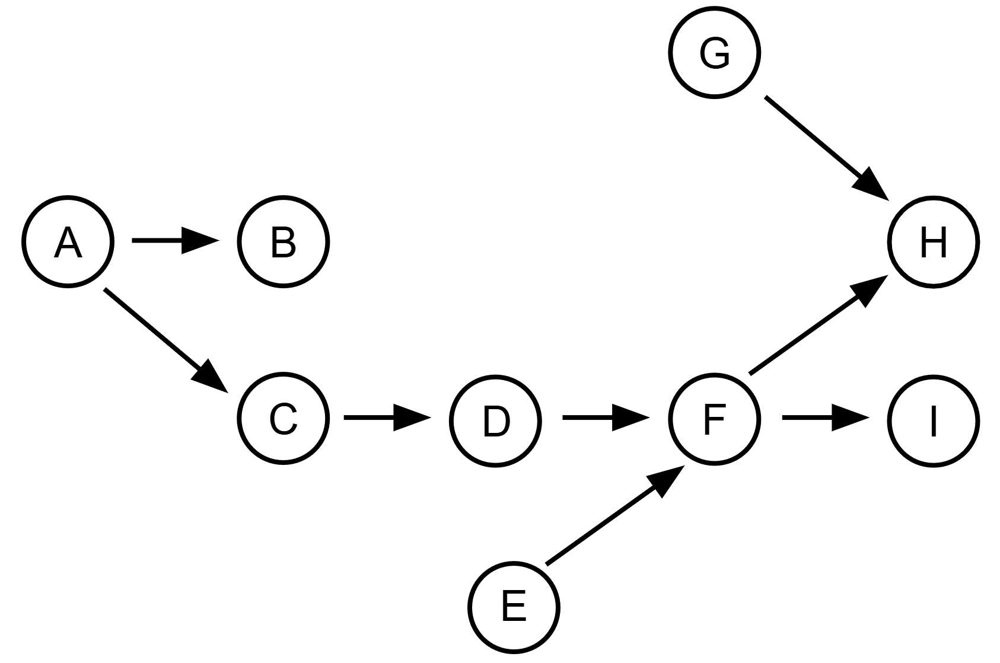
</div>

</div>


---
layout: center
---

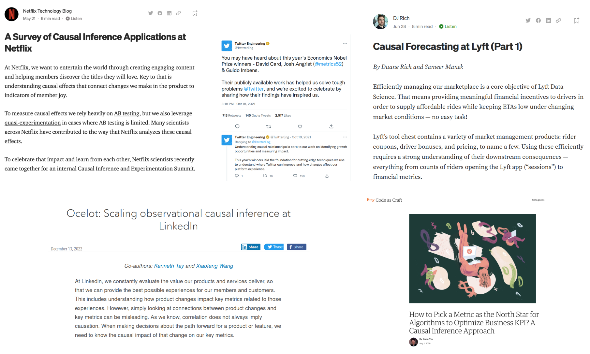


---

# Learning Objectives

By the end of this tutorial, you should be able to:
<br><br>

* • Understand the pitfalls of observational data analysis
* • Know the key types of causal relationships
* • Understand AI/ML vs causal inference vs and experiments
* • Start conducting preliminary causal analyses
* • Confidently explore the topic on your own 


---
layout: center
---

<div class="flex justify-center items-center h-full">
<div id="vacationer-plot"></div>
</div>

<script setup>
import { onMounted } from 'vue'

onMounted(() => {
  // Load D3 from CDN
  const script = document.createElement('script')
  script.src = 'https://d3js.org/d3.v7.min.js'
  script.onload = () => {
    // Generate data similar to the original plot
    const generateData = () => {
      const data = []
      const n = 100

      for (let i = 0; i < n; i++) {
        const price = Math.random() * 100 + 10
        const baseBookings = 50 + price * 0.35
        const noise = (Math.random() - 0.5) * 50

        // Create the characteristic pattern
        //const distanceFromCenter = Math.abs(price - 45)
        const verticalSpread = 30 //+ distanceFromCenter * 1
        const verticalNoise = (Math.random() - 0.5) * verticalSpread * 2.5

        const bookings = Math.max(20, Math.min(120, baseBookings + verticalNoise))
        data.push({ price, bookings })
      }
      return data
    }

    const data = generateData()

    // Set up dimensions
    const margin = { top: 20, right: 30, bottom: 50, left: 60 }
    const width = 800 - margin.left - margin.right
    const height = 500 - margin.top - margin.bottom

    // Create SVG
    const svg = window.d3.select('#vacationer-plot')
      .append('svg')
      .attr('width', width + margin.left + margin.right)
      .attr('height', height + margin.top + margin.bottom)
      .append('g')
      .attr('transform', `translate(${margin.left},${margin.top})`)

    // Set up scales
    const xScale = window.d3.scaleLinear()
      .domain([10, 80])
      .range([0, width])

    const yScale = window.d3.scaleLinear()
      .domain([20, 120])
      .range([height, 0])

    // Add scatter points
    svg.selectAll('circle')
      .data(data)
      .enter()
      .append('circle')
      .attr('cx', d => xScale(d.price))
      .attr('cy', d => yScale(d.bookings))
      .attr('r', 3)
      .attr('fill', 'steelblue')
      .attr('opacity', 0.6)

    // Calculate linear regression for trendline
    const xMean = window.d3.mean(data, d => d.price)
    const yMean = window.d3.mean(data, d => d.bookings)

    let numerator = 0
    let denominator = 0

    data.forEach(d => {
      numerator += (d.price - xMean) * (d.bookings - yMean)
      denominator += (d.price - xMean) ** 2
    })

    const slope = numerator / denominator
    const intercept = yMean - slope * xMean

    // Add trendline
    const trendlineData = [
      { price: 10, bookings: slope * 10 + intercept },
      { price: 80, bookings: slope * 80 + intercept }
    ]

    svg.append('line')
      .attr('x1', xScale(trendlineData[0].price))
      .attr('y1', yScale(trendlineData[0].bookings))
      .attr('x2', xScale(trendlineData[1].price))
      .attr('y2', yScale(trendlineData[1].bookings))
      .attr('stroke', '#666')
      .attr('stroke-width', 2)

    // Add X axis
    svg.append('g')
      .attr('transform', `translate(0,${height})`)
      .call(window.d3.axisBottom(xScale))
      .append('text')
      .attr('x', width / 2)
      .attr('y', 40)
      .attr('fill', 'black')
      .style('font-size', '14px')
      .text('Price (USD)')

    // Add Y axis
    svg.append('g')
      .call(window.d3.axisLeft(yScale))
      .append('text')
      .attr('transform', 'rotate(-90)')
      .attr('x', -height / 2)
      .attr('y', -45)
      .attr('fill', 'black')
      .style('font-size', '14px')
      .text('Bookings Each Week')
  }
  document.head.appendChild(script)
})
</script>


---

# Is this plot useful? 🏖️


As a vacationer looking to avoid a crowded hotel? This is fine 👍
<br><br>
As a hotel owner trying to optimize your pricing with this plot is useless ❌ 


---
layout: two-cols
---


::right::


---
layout: center
---


---
layout: center
---

Does exposure to this radium clock cause cancer? 


---
layout: center
---

# … what happens in an alternative universe?

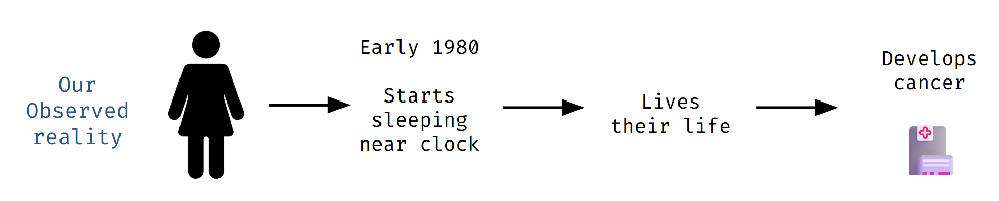


---
layout: center
---

# … what happens in an alternative universe?

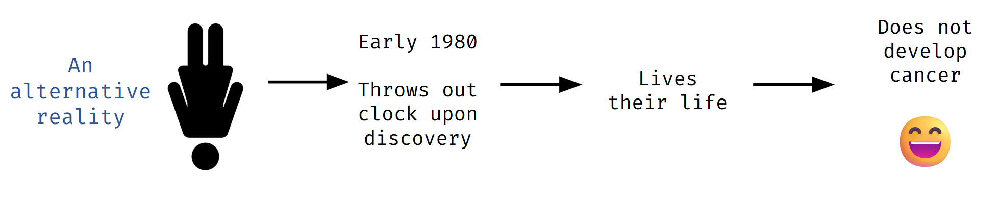


---
layout: center
---

# Counterfactuals (“Counter to fact”)


---

# Counterfactuals

You can also think of counterfactuals as a **missing data problem**

| ID# | special offer | age | device  | churn? |
|-----|---------------|-----|---------|--------|
| 1   | Y             | 40  | iphone  | Y      |
| 2   | Y             | 35  | android | N      |
| 3   | N             | 77  | iphone  | N      |
| 4   | Y             | 18  | android | N      |

---


| ID# | Observed? | special offer | age | device  | churn? |
|-----|-----------|---------------|-----|---------|--------|
| 1   | ✓         | Y             | 40  | iphone  | Y      |
| 1   | ✗         | N             | 40  | iphone  | ???    |
| 2   | ✓         | Y             | 35  | android | N      |
| 2   | ✗         | N             | 35  | android | ???    |
| 3   | ✗         | Y             | 77  | iphone  | ???    |
| 3   | ✓         | N             | 77  | iphone  | N      |
| 4   | ✓         | Y             | 18  | android | N      |
| 4   | ✗         | N             | 18  | android | ???    |


---

# Experiments / A/B Tests / Randomized Controlled Trials

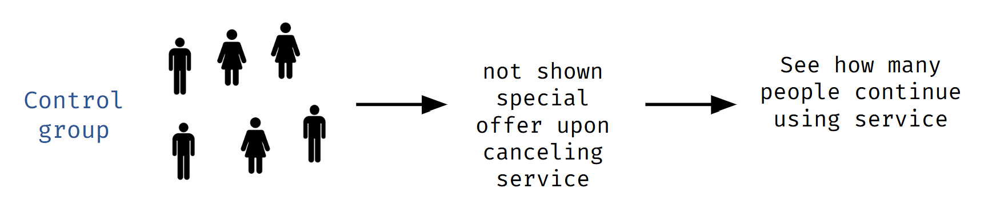


---

# Experiments / A/B Tests / Randomized Controlled Trials

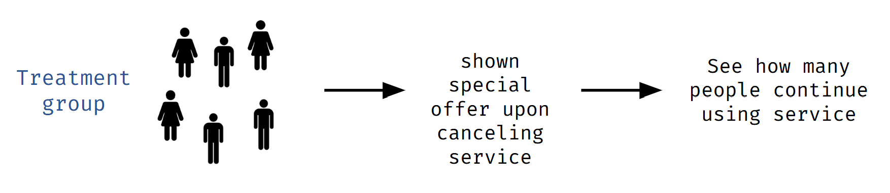


---

# When Experiments Aren't Feasible

- • Understanding how a user's behavior changes when they switch from an iPhone to the newest Samsung phone
- • Too few units, such as in a Merger and Acquisition scenario (there is one event that may or may not happen)
- • Modify household incomes in neighborhoods, to see if reducing a neighborhood's income inequality reduces the local crime rate

---

# When Experiments Aren't Ethical

- • Randomly assign some people to be exposed to lead paint while others are not, then see which group is more likely to develop neurological disorders
- • Assigning some social media users to receive more psychologically dark posts to understand how it impacts engagement


---

# The Hierarchy of Evidence

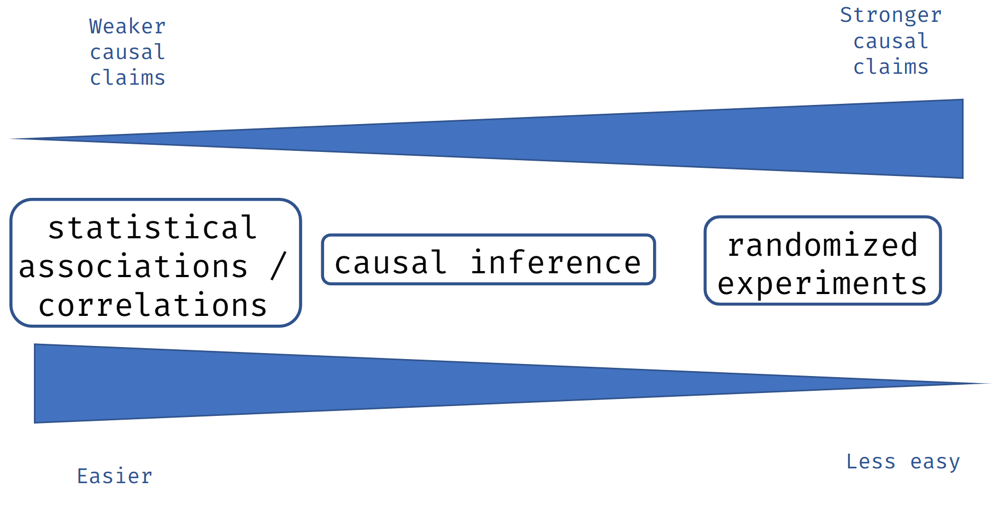


---

# Important Note on Correlations


I'm referring to **RAW associations and correlations**. Calculating correlations is **indispensable** in causal inference work, but we make intelligent adjustments to make them useful.


---
layout: two-cols
---


# Causal Inference <br> Questions

- • How does improving neighborhood income inequality **reduce** neighborhood crime rate?
- • How does **increasing or decreasing** the price of a product impact demand?
- • What would be the **impact** on diabetes if we reduced average sugar consumption by X grams?


::right::

# Standard ML <br> Questions
<br>

- • Can I **cluster** neighborhoods by their characteristics?
- • Can I **predict** whether someone will convert from a lead to a customer?
- • How well can I **predict** whether a patient will be diagnosed with diabetes later in life?


---

# A Causal Graph (DAG)

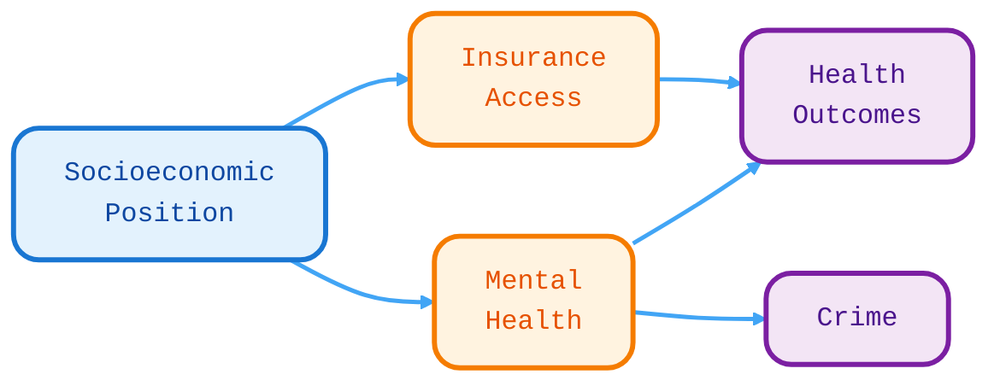
```mermaid
%%{init: {'theme':'base', 'themeVariables': { 'primaryColor':'#e3f2fd','primaryTextColor':'#0d47a1','primaryBorderColor':'#1976d2','lineColor':'#42a5f5','secondaryColor':'#fff3e0','tertiaryColor':'#f3e5f5','fontFamily':'Fira Code, monospace'}, 'flowchart': {'htmlLabels': true, 'useMaxWidth': true}}}%%
graph LR
    A["<div style='text-align:center;font-family:Fira Code,monospace'>Socioeconomic<br/>Position</div>"]:::cause
    B["<div style='text-align:center;font-family:Fira Code,monospace'>Insurance<br/>Access</div>"]:::mediator
    C["<div style='text-align:center;font-family:Fira Code,monospace'>Mental<br/>Health</div>"]:::mediator
    D["<div style='text-align:center;font-family:Fira Code,monospace'>Health<br/>Outcomes</div>"]:::outcome
    E["<div style='text-align:center;font-family:Fira Code,monospace'>Crime</div>"]:::outcome

    A --> B
    A --> C
    B --> D
    C --> D
    C --> E

    classDef cause fill:#e3f2fd,stroke:#1976d2,stroke-width:3px,color:#0d47a1,rx:15,ry:15
    classDef mediator fill:#fff3e0,stroke:#f57c00,stroke-width:3px,color:#e65100,rx:15,ry:15
    classDef outcome fill:#f3e5f5,stroke:#7b1fa2,stroke-width:3px,color:#4a148c,rx:15,ry:15

    linkStyle default stroke:#42a5f5,stroke-width:2.5px
```

<div class="text-center mt-8">
Directed Acyclic Graphs (DAGs) help us visualize causal relationships
</div>


---
layout: center
class: text-center
---

# Exercise Time! 🎯

Let's practice creating causal graphs

---
layout: two-cols
---

# Car Insurance and causality

- Make & model
- Theft history
- Car value
- Advanced airbag
- Antilock brakes
- Driving course completion
- Vehicle year

:: right :: 
<br><br><br>
- Car safety rating
- Accident history
- Age
- Medical cost of accident
- Good student status
- Risk aversion


---
layout: center
class: text-center
---

# Three Important Types of Causal Relationships

---

# 1) Confounders


```mermaid
%%{init: {'theme':'base', 'themeVariables': { 'primaryColor':'#fff9c4','primaryTextColor':'#f57f17','primaryBorderColor':'#f9a825','lineColor':'#42a5f5','secondaryColor':'#e3f2fd','tertiaryColor':'#f3e5f5','fontFamily':'Fira Code, monospace'}, 'flowchart': {'htmlLabels': true, 'useMaxWidth': true}}}%%
graph LR
    C["<div style='text-align:center;font-family:Fira Code,monospace'>Confounder</div>"]:::confounder
    T["<div style='text-align:center;font-family:Fira Code,monospace'>Treatment</div>"]:::treatment
    O["<div style='text-align:center;font-family:Fira Code,monospace'>Outcome</div>"]:::outcome

    C --> T
    C --> O
    T --> O

    classDef confounder fill:#fff9c4,stroke:#f9a825,stroke-width:3px,color:#f57f17,rx:15,ry:15
    classDef treatment fill:#e3f2fd,stroke:#1976d2,stroke-width:3px,color:#0d47a1,rx:15,ry:15
    classDef outcome fill:#f3e5f5,stroke:#7b1fa2,stroke-width:3px,color:#4a148c,rx:15,ry:15

    linkStyle 0,1,2 stroke:#42a5f5,stroke-width:2.5px

```

<div class="mt-8">

- • Always want to **control for** confounders in inferential modeling
- • Confounding changes the effect size and possibly statistical significance
- • Confounders can also **flip the direction** of your association of interest
- • Leftover confounding is called "residual confounding"

</div>

---

# Confounding Example: AirBnB


```mermaid
%%{init: {'theme':'base', 'themeVariables': { 'primaryColor':'#fff9c4','primaryTextColor':'#f57f17','primaryBorderColor':'#f9a825','lineColor':'#42a5f5','secondaryColor':'#e3f2fd','tertiaryColor':'#f3e5f5','fontFamily':'Fira Code, monospace'}, 'flowchart': {'htmlLabels': true, 'useMaxWidth': true}}}%%
graph LR
    TD["<div style='text-align:center;font-family:Fira Code,monospace'>Tourism<br/>Demand</div>"]:::confounder
    AB["<div style='text-align:center;font-family:Fira Code,monospace'>Presence of<br/>AirBnB</div>"]:::treatment
    HP["<div style='text-align:center;font-family:Fira Code,monospace'>House<br/>Prices</div>"]:::outcome

    TD --> AB
    TD --> HP
    AB --> HP

    classDef confounder fill:#fff9c4,stroke:#f9a825,stroke-width:3px,color:#f57f17,rx:15,ry:15
    classDef treatment fill:#e3f2fd,stroke:#1976d2,stroke-width:3px,color:#0d47a1,rx:15,ry:15
    classDef outcome fill:#f3e5f5,stroke:#7b1fa2,stroke-width:3px,color:#4a148c,rx:15,ry:15

    linkStyle 0,1,2 stroke:#42a5f5,stroke-width:2.5px
```

<div class="mt-8">

**Tourism demand** is a confounder:
- • It increases AirBnB presence
- • It increases house prices
- • Creates a modifies any true relationship between AirBnB and prices

</div>

---

# Types of Confounding

<div class="grid grid-cols-2 gap-8 mt-8">

<div>

### Positive Confounding
Confounder introduces a bias that pushes association **away from zero**

</div>

<div>

### Negative Confounding
Confounder biases association **towards the zero**

</div>

</div>

---

# Classic Example: Ice Cream & Crime

<div class="text-center mt-8">
Do ice cream sales cause violent crime? 🍦 → 🔫
</div> <br>

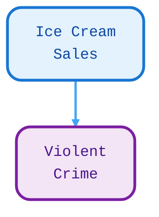
```mermaid
%%{init: {'theme':'base', 'themeVariables': { 'primaryColor':'#fff9c4','primaryTextColor':'#f57f17','primaryBorderColor':'#f9a825','lineColor':'#42a5f5','secondaryColor':'#e3f2fd','tertiaryColor':'#f3e5f5','fontFamily':'Fira Code, monospace'}, 'flowchart': {'htmlLabels': true, 'useMaxWidth': true}}}%%
graph TD

    IC["<div style='text-align:center;font-family:Fira Code,monospace'>Ice Cream<br/>Sales</div>"]:::treatment
    VC["<div style='text-align:center;font-family:Fira Code,monospace'>Violent<br/>Crime</div>"]:::outcome

    IC --> VC

    classDef treatment fill:#e3f2fd,stroke:#1976d2,stroke-width:3px,color:#0d47a1,rx:15,ry:15
    classDef outcome fill:#f3e5f5,stroke:#7b1fa2,stroke-width:3px,color:#4a148c,rx:15,ry:15

    linkStyle 0 stroke:#42a5f5,stroke-width:2.5px
    

```
---

# Not what it seems

<div class="text-center mt-8">
Do ice cream sales cause violent crime? 🍦 → 🔫
</div>

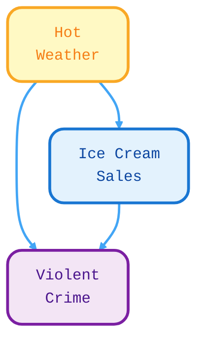
```mermaid
%%{init: {'theme':'base', 'themeVariables': { 'primaryColor':'#fff9c4','primaryTextColor':'#f57f17','primaryBorderColor':'#f9a825','lineColor':'#42a5f5','secondaryColor':'#e3f2fd','tertiaryColor':'#f3e5f5','fontFamily':'Fira Code, monospace'}, 'flowchart': {'htmlLabels': true, 'useMaxWidth': true}}}%%
graph TD
    HW["<div style='text-align:center;font-family:Fira Code,monospace'>Hot<br/>Weather</div>"]:::confounder
    IC["<div style='text-align:center;font-family:Fira Code,monospace'>Ice Cream<br/>Sales</div>"]:::treatment
    VC["<div style='text-align:center;font-family:Fira Code,monospace'>Violent<br/>Crime</div>"]:::outcome

    HW --> IC
    HW --> VC
    IC --> VC

    classDef confounder fill:#fff9c4,stroke:#f9a825,stroke-width:3px,color:#f57f17,rx:15,ry:15
    classDef treatment fill:#e3f2fd,stroke:#1976d2,stroke-width:3px,color:#0d47a1,rx:15,ry:15
    classDef outcome fill:#f3e5f5,stroke:#7b1fa2,stroke-width:3px,color:#4a148c,rx:15,ry:15

    linkStyle 0,1 stroke:#42a5f5,stroke-width:2.5px
    linkStyle 2 stroke:#42a5f5,stroke-width:2.5px
```


---

# Controlling for Confounders

After controlling for season/weather, the ice cream-crime association disappears!

<div class="mt-8">

**How do we "control" for things?**
<br><br>

**Option 1**: Stratification (simple/naive way)
- • Filter your dataset so the confounder only takes on 1 value
- • Example: `p(violent_crime = 1 | hot_weather = 0)`

<br>

**Option 2**: Use a model!
- • We'll go deep on this in the second half of the tutorial

</div>


---

# How Experiments Break Confounding


```mermaid
%%{init: {'theme':'base', 'themeVariables': { 'primaryColor':'#fff9c4','primaryTextColor':'#f57f17','primaryBorderColor':'#f9a825','lineColor':'#42a5f5','secondaryColor':'#e3f2fd','tertiaryColor':'#f3e5f5','fontFamily':'Fira Code, monospace'}, 'flowchart': {'htmlLabels': true, 'useMaxWidth': true}}}%%
graph LR
    SES["<div style='text-align:center;font-family:Fira Code,monospace'>Socioeconomic<br/>Status</div>"]:::confounder
    CS["<div style='text-align:center;font-family:Fira Code,monospace'>Classroom<br/>Size</div>"]:::treatment
    SP["<div style='text-align:center;font-family:Fira Code,monospace'>Student<br/>Performance</div>"]:::outcome

    SES --> CS
    SES --> SP
    CS --> SP

    classDef confounder fill:#fff9c4,stroke:#f9a825,stroke-width:3px,color:#f57f17,rx:15,ry:15
    classDef treatment fill:#e3f2fd,stroke:#1976d2,stroke-width:3px,color:#0d47a1,rx:15,ry:15
    classDef outcome fill:#f3e5f5,stroke:#7b1fa2,stroke-width:3px,color:#4a148c,rx:15,ry:15

    linkStyle 0,1,2 stroke:#42a5f5,stroke-width:2.5px
```


---

# How Experiments Break Confounding

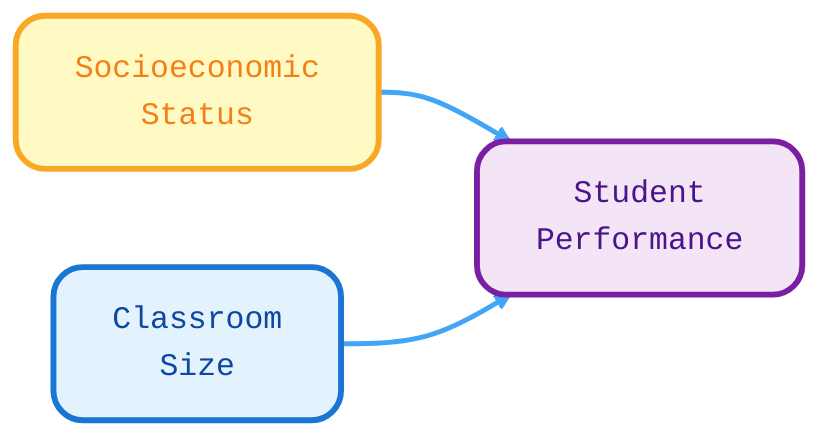
```mermaid
%%{init: {'theme':'base', 'themeVariables': { 'primaryColor':'#fff9c4','primaryTextColor':'#f57f17','primaryBorderColor':'#f9a825','lineColor':'#42a5f5','secondaryColor':'#e3f2fd','tertiaryColor':'#f3e5f5','fontFamily':'Fira Code, monospace'}, 'flowchart': {'htmlLabels': true, 'useMaxWidth': true}}}%%
graph LR
    SES["<div style='text-align:center;font-family:Fira Code,monospace'>Socioeconomic<br/>Status</div>"]:::confounder
    CS["<div style='text-align:center;font-family:Fira Code,monospace'>Classroom<br/>Size</div>"]:::treatment
    SP["<div style='text-align:center;font-family:Fira Code,monospace'>Student<br/>Performance</div>"]:::outcome

    SES --> SP
    CS --> SP

    classDef confounder fill:#fff9c4,stroke:#f9a825,stroke-width:3px,color:#f57f17,rx:15,ry:15
    classDef treatment fill:#e3f2fd,stroke:#1976d2,stroke-width:3px,color:#0d47a1,rx:15,ry:15
    classDef outcome fill:#f3e5f5,stroke:#7b1fa2,stroke-width:3px,color:#4a148c,rx:15,ry:15

    linkStyle 0,1 stroke:#42a5f5,stroke-width:2.5px
```

<div class="mt-8">

In experiments, **randomization breaks** the association between confounders and treatment! The randomization ensures classroom size is independent of socioeconomic status.

</div>

---

# Circling back to experiments vs causal inference

<div class="text-center mt-8">

**Experiments** are wonderful because randomization breaks all confounding

<br><br>

**Causal inference** is when we take non-experimental (observational) data and carefully try to pick apart the confounding ourselves

</div>

---

# 2) Colliders

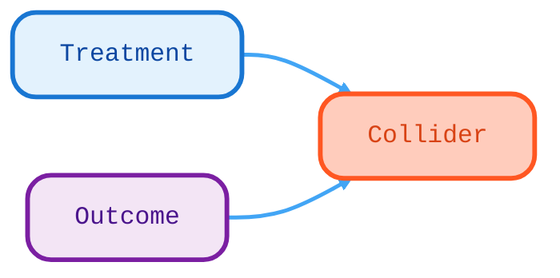
```mermaid
%%{init: {'theme':'base', 'themeVariables': { 'primaryColor':'#ffccbc','primaryTextColor':'#d84315','primaryBorderColor':'#ff5722','lineColor':'#42a5f5','secondaryColor':'#e3f2fd','tertiaryColor':'#f3e5f5','fontFamily':'Fira Code, monospace'}, 'flowchart': {'htmlLabels': true, 'useMaxWidth': true}}}%%
graph LR
    T["<div style='text-align:center;font-family:Fira Code,monospace'>Treatment</div>"]:::treatment
    C["<div style='text-align:center;font-family:Fira Code,monospace'>Collider</div>"]:::collider
    O["<div style='text-align:center;font-family:Fira Code,monospace'>Outcome</div>"]:::outcome

    T --> C
    O --> C

    classDef treatment fill:#e3f2fd,stroke:#1976d2,stroke-width:3px,color:#0d47a1,rx:15,ry:15
    classDef collider fill:#ffccbc,stroke:#ff5722,stroke-width:3px,color:#d84315,rx:15,ry:15
    classDef outcome fill:#f3e5f5,stroke:#7b1fa2,stroke-width:3px,color:#4a148c,rx:15,ry:15

    linkStyle 0,1 stroke:#42a5f5,stroke-width:2.5px
```

<div class="mt-8">

**Key points:**
- • **Never** want to control for colliders!
- • Conditioning on a common effect causes **collider bias**
- • Can bias results in positive or negative direction

</div>

---

# Collider Example: Sick Days

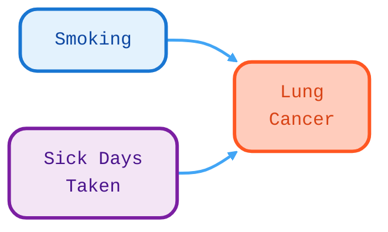
```mermaid
%%{init: {'theme':'base', 'themeVariables': { 'primaryColor':'#ffccbc','primaryTextColor':'#d84315','primaryBorderColor':'#ff5722','lineColor':'#42a5f5','secondaryColor':'#e3f2fd','tertiaryColor':'#f3e5f5','fontFamily':'Fira Code, monospace'}, 'flowchart': {'htmlLabels': true, 'useMaxWidth': true}}}%%
graph LR
    S["<div style='text-align:center;font-family:Fira Code,monospace'>Smoking</div>"]:::treatment
    LC["<div style='text-align:center;font-family:Fira Code,monospace'>Lung<br/>Cancer</div>"]:::collider
    SD["<div style='text-align:center;font-family:Fira Code,monospace'>Sick Days<br/>Taken</div>"]:::outcome

    S --> LC
    SD --> LC

    classDef treatment fill:#e3f2fd,stroke:#1976d2,stroke-width:3px,color:#0d47a1,rx:15,ry:15
    classDef collider fill:#ffccbc,stroke:#ff5722,stroke-width:3px,color:#d84315,rx:15,ry:15
    classDef outcome fill:#f3e5f5,stroke:#7b1fa2,stroke-width:3px,color:#4a148c,rx:15,ry:15

    linkStyle 0,1 stroke:#42a5f5,stroke-width:2.5px
```

<div class="mt-8">

If you control for lung cancer (the collider), you'll create a spurious association between smoking and sick days taken!

</div>

---

# 3) Mediators


```mermaid
%%{init: {'theme':'base', 'themeVariables': { 'primaryColor':'#c8e6c9','primaryTextColor':'#2e7d32','primaryBorderColor':'#4caf50','lineColor':'#42a5f5','secondaryColor':'#e3f2fd','tertiaryColor':'#f3e5f5','fontFamily':'Fira Code, monospace'}, 'flowchart': {'htmlLabels': true, 'useMaxWidth': true}}}%%
graph LR
    T["<div style='text-align:center;font-family:Fira Code,monospace'>Treatment</div>"]:::treatment
    M["<div style='text-align:center;font-family:Fira Code,monospace'>Mediator</div>"]:::mediator
    O["<div style='text-align:center;font-family:Fira Code,monospace'>Outcome</div>"]:::outcome

    T --> M --> O

    classDef treatment fill:#e3f2fd,stroke:#1976d2,stroke-width:3px,color:#0d47a1,rx:15,ry:15
    classDef mediator fill:#c8e6c9,stroke:#4caf50,stroke-width:3px,color:#2e7d32,rx:15,ry:15
    classDef outcome fill:#f3e5f5,stroke:#7b1fa2,stroke-width:3px,color:#4a148c,rx:15,ry:15

    linkStyle 0,1 stroke:#42a5f5,stroke-width:2.5px
```

<div class="mt-8">

**Key points:**
- • Controlling for a mediator will **nullify** any relationship between treatment and outcome
- • Helps determine causal pathways in observational data

</div>

---

# Mediator Example: Rideshare


```mermaid
%%{init: {'theme':'base', 'themeVariables': { 'primaryColor':'#c8e6c9','primaryTextColor':'#2e7d32','primaryBorderColor':'#4caf50','lineColor':'#42a5f5','secondaryColor':'#e3f2fd','tertiaryColor':'#f3e5f5','fontFamily':'Fira Code, monospace'}, 'flowchart': {'htmlLabels': true, 'useMaxWidth': true}}}%%
graph LR
    HR["<div style='text-align:center;font-family:Fira Code,monospace'>Hours of<br/>Rain</div>"]:::treatment
    RR["<div style='text-align:center;font-family:Fira Code,monospace'>Rideshare<br/>Requests</div>"]:::mediator
    DP["<div style='text-align:center;font-family:Fira Code,monospace'>Daily<br/>Profit</div>"]:::outcome

    HR --> RR --> DP

    classDef treatment fill:#e3f2fd,stroke:#1976d2,stroke-width:3px,color:#0d47a1,rx:15,ry:15
    classDef mediator fill:#c8e6c9,stroke:#4caf50,stroke-width:3px,color:#2e7d32,rx:15,ry:15
    classDef outcome fill:#f3e5f5,stroke:#7b1fa2,stroke-width:3px,color:#4a148c,rx:15,ry:15

    linkStyle 0,1 stroke:#42a5f5,stroke-width:2.5px
```

<div class="mt-8">

If you control for rideshare requests (the mediator), you'll eliminate the effect of rain on profit! The requests ARE the mechanism by which rain affects profit.

</div>

---

# Putting It All Together

<br>
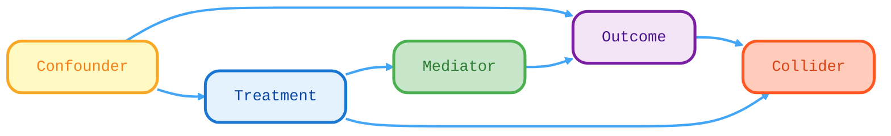
```mermaid
%%{init: {'theme':'base', 'themeVariables': { 'fontFamily':'Fira Code, monospace'}, 'flowchart': {'htmlLabels': true, 'useMaxWidth': true}}}%%
graph LR
    CF["<div style='text-align:center;font-family:Fira Code,monospace'>Confounder</div>"]:::confounder
    T["<div style='text-align:center;font-family:Fira Code,monospace'>Treatment</div>"]:::treatment
    O["<div style='text-align:center;font-family:Fira Code,monospace'>Outcome</div>"]:::outcome
    M["<div style='text-align:center;font-family:Fira Code,monospace'>Mediator</div>"]:::mediator
    CL["<div style='text-align:center;font-family:Fira Code,monospace'>Collider</div>"]:::collider

    CF --> O
    CF --> T
    T --> M
    M --> O
    T --> CL
    O --> CL

    classDef confounder fill:#fff9c4,stroke:#f9a825,stroke-width:3px,color:#f57f17,rx:15,ry:15
    classDef treatment fill:#e3f2fd,stroke:#1976d2,stroke-width:3px,color:#0d47a1,rx:15,ry:15
    classDef outcome fill:#f3e5f5,stroke:#7b1fa2,stroke-width:3px,color:#4a148c,rx:15,ry:15
    classDef mediator fill:#c8e6c9,stroke:#4caf50,stroke-width:3px,color:#2e7d32,rx:15,ry:15
    classDef collider fill:#ffccbc,stroke:#ff5722,stroke-width:3px,color:#d84315,rx:15,ry:15

    linkStyle default stroke:#42a5f5,stroke-width:2.5px
```

<div class="text-center mt-8">
✅ Control for confounders<br/>
❌ Don't control for colliders<br/>
⚠️ Be careful with mediators
</div>

---

# Reality is Complicated! Real-world causal graphs can be extremely complex.


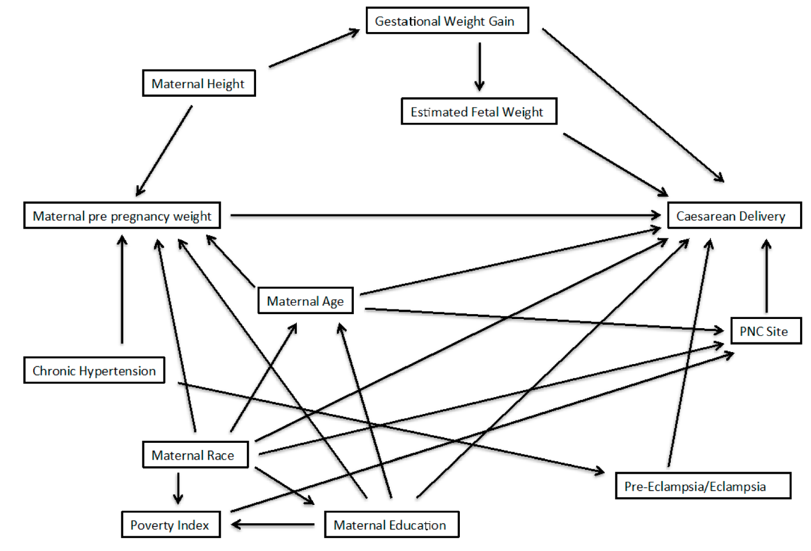

---
layout: center
class: text-center
---

# Notebook Exercise #1: <br> Causal Graphs

Time to practice! 🚀


---
layout: center
---

<div style="transform: scale(0.7); transform-origin: center;">

```python
temperature = np.random.normal(loc=23, scale=3, size=100000)
price = 2 * temperature + np.random.normal(0, 5, size=100000)
bookings = -0.25 * price + 5 * temperature + np.random.normal(0, 5, size=100000)

data = pd.DataFrame({
    "temperature": temperature,
    "price": price,
    "bookings": bookings
})

# Let's round these columns to make them seem more real
data["temperature"] = data["temperature"].round(1)
data["price"] = data["price"].round(2)
data["bookings"] = data["bookings"].astype(int)
```

</div>


---
layout: center
---

# Important Asides

---

# Avoid Automated Causal Discovery

<div style="display: flex; gap: 2rem; margin-top: 2rem;">

<div style="flex: 1;">


```mermaid
%%{init: {'theme':'base', 'themeVariables': { 'fontFamily':'Fira Code, monospace'}, 'flowchart': {'htmlLabels': true, 'useMaxWidth': true}}}%%
graph LR
    A["<div style='text-align:center;font-family:Fira Code,monospace'>A</div>"]:::node
    B["<div style='text-align:center;font-family:Fira Code,monospace'>B</div>"]:::node
    C["<div style='text-align:center;font-family:Fira Code,monospace'>C</div>"]:::node

    A --> B --> C

    classDef node fill:#e3f2fd,stroke:#1976d2,stroke-width:3px,color:#0d47a1,rx:15,ry:15
    linkStyle default stroke:#42a5f5,stroke-width:2.5px
```

<br>

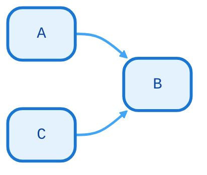
```mermaid
%%{init: {'theme':'base', 'themeVariables': { 'fontFamily':'Fira Code, monospace'}, 'flowchart': {'htmlLabels': true, 'useMaxWidth': true}}}%%
graph LR
    A["<div style='text-align:center;font-family:Fira Code,monospace'>A</div>"]:::node
    B["<div style='text-align:center;font-family:Fira Code,monospace'>B</div>"]:::node
    C["<div style='text-align:center;font-family:Fira Code,monospace'>C</div>"]:::node

    A --> B
    C --> B

    classDef node fill:#e3f2fd,stroke:#1976d2,stroke-width:3px,color:#0d47a1,rx:15,ry:15
    linkStyle default stroke:#42a5f5,stroke-width:2.5px
```

<br>


```mermaid
%%{init: {'theme':'base', 'themeVariables': { 'fontFamily':'Fira Code, monospace'}, 'flowchart': {'htmlLabels': true, 'useMaxWidth': true}}}%%
graph LR
    A["<div style='text-align:center;font-family:Fira Code,monospace'>A</div>"]:::node
    B["<div style='text-align:center;font-family:Fira Code,monospace'>B</div>"]:::node
    C["<div style='text-align:center;font-family:Fira Code,monospace'>C</div>"]:::node

    B --> A
    C --> B

    classDef node fill:#e3f2fd,stroke:#1976d2,stroke-width:3px,color:#0d47a1,rx:15,ry:15
    linkStyle default stroke:#42a5f5,stroke-width:2.5px
```

</div>

<div style="flex: 1.2; display: flex; align-items: center;">
<div style="border-left: 5px solid #1976d2; padding-left: 2rem;">

**These three graphs belong to the same "Markov Equivalence Class" and are indistinguishable with observational data!**

<div style="margin-top: 2rem;">

❌ Don't rely on automated causal graph structure learning algorithms

✅ Stick with good domain knowledge

</div>

</div>
</div>

</div>

---
layout: center
---

# LLMs and Causality

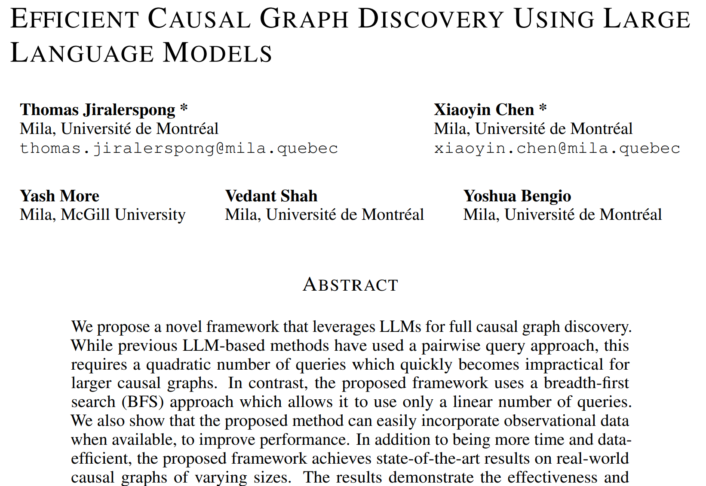


---
layout: center
---

# LLMs and Causality

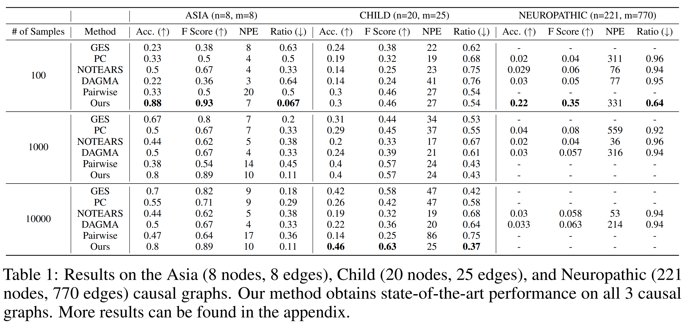


---
layout: two-cols
---


# ⚠️ Traditional variable importance methods don't tell you anything about causality!


<div class="mt-8">

<br>

These tools are useful for prediction, but not for causal inference!
</div>

:: right ::

<br>
<br>
<br>
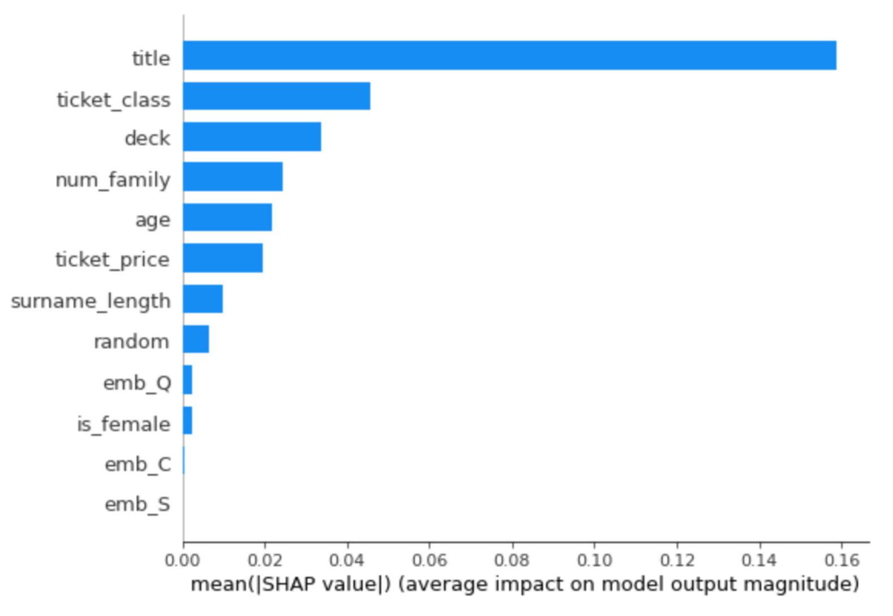


---
layout: center
---

We've discussed three types of causal relationships.

Going forward, we're going to assume you identified key **confounders** you want to control for, as you estimate the causal impact between a **"treatment"** and an **"outcome"**...


---

# If You Are Doing Causal Modeling...


1. **Think before looking at data** - Carefully consider quantities of interest and their relationships using domain knowledge

2. **Stick with a small set of important variables** - Only include variables you have domain knowledge about

3. **Understand bivariate relationships** - Before modeling, examine relationships between:
   - • Independent variables with each other
   - • Independent variables with dependent variable

4. **Identify potential confounders** - Clearly identify covariates to control for and those NOT to control for


---

# Assumptions of Causal Inference

<div class="mt-8">

**Four Key Assumptions:**

1. **Temporality** - Causes always occur before effects. Treatment must occur before measured outcome. Covariates should occur before treatment.

2. **SUTVA (Stable Unit Treatment Value)** - The treatment status of one individual does not affect the potential outcomes of any other individuals.

3. **Positivity** - For each level of each covariate, there needs to be some variability in treatment and outcome variables.

4. **Ignorability** - All major confounding variables are included in your data. This is tough but necessary for unbiased treatment effect estimates.

</div>

---

# Assumption Violations: Example #1

**Temporality Violation**

<div class="mt-8">

**Scenario:** I want to understand whether frequent emails to customers might impact customer satisfaction.

I have survey data with customer self-reported satisfaction from a year ago, and I use this past month's number of emails for each customer as a proxy for how often we email them generally.

**⚠️ Problem:** Past satisfaction cannot be caused by future emails! Temporal ordering is violated.

</div>

---

# Assumption Violations: Example #2

**Positivity Violation**

<div class="mt-8">

**Scenario:** I want to see the causal impact of a neighborhood's cleanliness on crime rates, controlling for 20 known confounders.

I pull up an academic dataset with data on 40 distinct neighborhoods. So, my sample size is 40.

**⚠️ Problem:** 20 covariates with only 40 observations! Severe overfitting risk and positivity violations are likely.

</div>

---

# Assumption Violations: Example #3

**SUTVA Violation**

<div class="mt-8">

**Scenario:** I want to see how releasing a new in-app, multiplayer game through my social media app impacts user engagement. I only want to give it to some test users initially.

With this multiplayer game you can play with anyone who has the social media app by sending them invites. Accidentally, our test users can invite non-test users.

**⚠️ Problem:** Treatment spillover! Test users affect control users through invites, violating independence.

</div>

---

# Assumption Violations: Example #4

**Ignorability Violation**

<div class="mt-8">

**Scenario:** We're curious how a job training program could impact a person's income 3 years in the future.

Unfortunately we don't have lots of data on the participants so we perform a causal inference analysis only controlling for the person's age.

**⚠️ Problem:** Massive residual confounding! Education, work history, location, industry, etc. are all missing.

</div>

---
layout: center
---

# Metrics for Causal Effects

---

# Counterfactuals with Binary Treatment (additive)

<br>

<div class="grid grid-cols-2 gap-8 mt-8">

<div>

### Observed Reality
Experiences 500ms delay on website

**Click-through rate: 60%**

</div>

<div>

### Alternative Reality
Experiences no delay on website

**Click-through rate: 65%**

</div>

</div>

<div class="text-center mt-8">
Average Treatment Effect = 60% - 65% = 5% drop
</div>

---


# Counterfactuals with Binary Treatment (ratio)

<br>

<div class="grid grid-cols-2 gap-8 mt-8">

<div>

### Observed Reality
Worked with radium for years

**20% probability of developing cancer in the coming year**

</div>

<div>

### Alternative Reality
Never worked with radium

**15% probability of developing cancer in the coming year**

</div>

</div>

<div class="text-center mt-8">
Average Treatment Effect = 20% / 15% = 1.3 times higher risk
</div>

---

# Important Note on Units of Analysis

<div class="mt-8">

You can apply causal inference to **any unit of analysis**:

- • People
- • Browser sessions
- • Webpages
- • Clusters of friends (social media data)
- • Neighborhoods
- • Buildings
- • Pharmacies
- • etc.

</div>

---

# Common Causal Metrics

| Metric | Population |
|--------|-----------|
| **ATE** - Average Treatment Effect | Effect in entire population |
| **ATT** - Average Treatment Effect Among Treated | Effect in treated population |
| **ATU** - Average Treatment Effect Among Untreated | Effect in untreated population |
| **ITE** - Individual Treatment Effect | Effect for a single unit |

---

# Conditional Causal Metrics

| Metric | Population |
|--------|-----------|
| **CATE** - Conditional Average Treatment Effect | Effect segmented by some covariate |
| **CATT** - Conditional ATT | Effect in treated, segmented by covariate |
| **CATU** - Conditional ATU | Effect in untreated, segmented by covariate |

---
layout: center
---

# Modeling Approaches for Causal Inference

---

# Interrupted Time Series


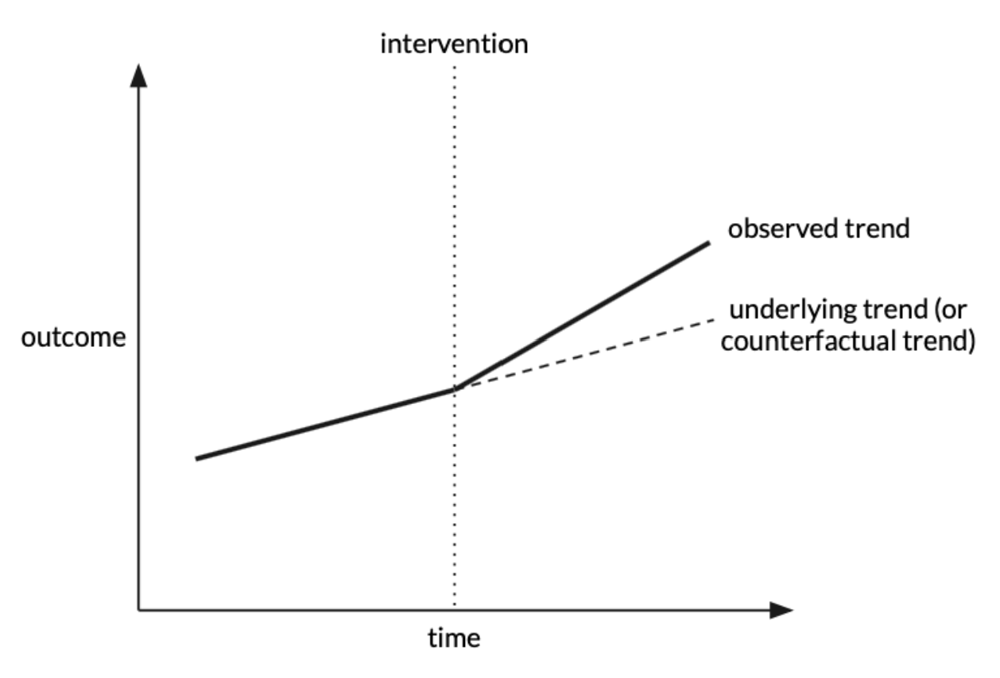

---


# Difference in Differences

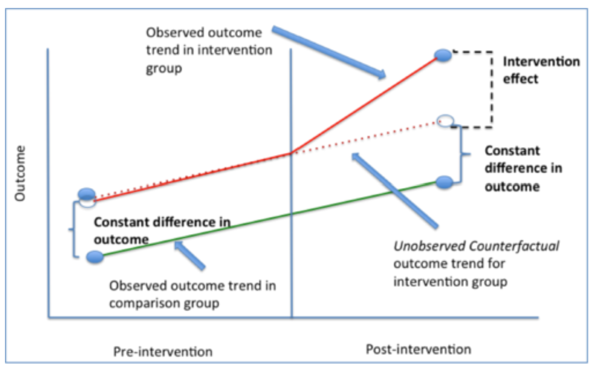

<br>
<div class="text-center">
(Treatment_post - Treatment_pre) - (Control_post - Control_pre)
</div>

---

# Propensity Score Matching (PSM)


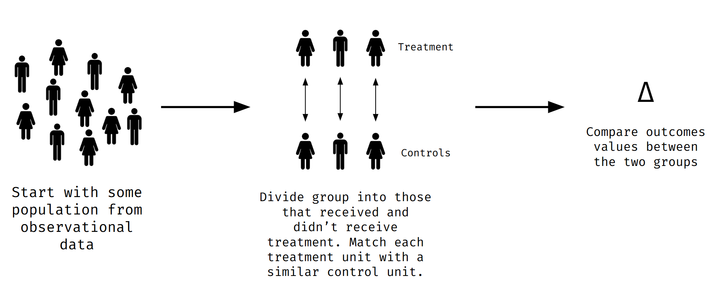


---

# PSM Step 1: Start with Data

| ID# | Covar 1 | Covar 2 | treat | outcome |
|-----|---------|---------|-------|---------|
| 1   | ...     | ...     | 1     | 20      |
| 2   | ...     | ...     | 1     | 15      |
| 3   | ...     | ...     | 0     | 10      |
| 4   | ...     | ...     | 0     | 10      |
| 5   | ...     | ...     | 1     | 20      |

---

# PSM Step 2: Calculate Propensity Scores

| ID# | Covar 1 | Covar 2 | treat | **ps** | outcome |
|-----|---------|---------|-------|--------|---------|
| 1   | ...     | ...     | 1     | **0.65** | 20    |
| 2   | ...     | ...     | 1     | **0.33** | 15    |
| 3   | ...     | ...     | 0     | **0.64** | 10    |
| 4   | ...     | ...     | 0     | **0.33** | 10    |
| 5   | ...     | ...     | 1     | **0.97** | 20    |

Use a model to predict `treat` from covariates

---

# PSM Step 3: Match Units

<div class="grid grid-cols-2 gap-4">

<div>

### Match 1
| ID# | treat | ps | outcome |
|-----|-------|-----|---------|
| 1   | 1     | 0.65 | 20     |
| 3   | 0     | 0.64 | 10     |

</div>

<div>

### Match 2
| ID# | treat | ps | outcome |
|-----|-------|-----|---------|
| 2   | 1     | 0.33 | 15     |
| 4   | 0     | 0.33 | 10     |

</div>

</div>

<div class="text-center mt-8">
Match based on similar propensity scores!
</div>

---

# PSM Step 4: Calculate Effect

| ID# | treat | outcome |
|-----|-------|---------|
| 1   | 1     | 20      |
| 2   | 1     | 15      |
| 3   | 0     | 10      |
| 4   | 0     | 10      |

<div class="text-center mt-8">
Average Treatment Effect = (20 + 15)/2 - (10 + 10)/2 = 7.5
</div>

---
layout: center
---

# Meta-learners: S-Learner

**Key idea:** Train a model to predict outcomes, then simulate counterfactuals

---

# S-Learner Step 1: Train model with a set of participants for whom we have complete data

| ID# | Covar 1 | Covar 2 | treat | outcome |
|-----|---------|---------|-------|---------|
| 1   | ...     | ...     | 1     | 20      |
| 2   | ...     | ...     | 1     | 15      |
| 3   | ...     | ...     | 0     | 10      |
| 4   | ...     | ...     | 0     | 10      |
| 5   | ...     | ...     | 1     | 20      |

Train a model: `outcome ~ covariates + treat`

---

# S-Learner Step 2: Predict outcome where everyone has treatment = 1

| ID# | Covar 1 | Covar 2 | treat | outcome | **ŷ(treat=1)** |
|-----|---------|---------|-------|---------|----------------|
| 1   | ...     | ...     | **1** | 20      | **22.5**       |
| 2   | ...     | ...     | **1** | 15      | **16.0**       |
| 3   | ...     | ...     | **1** | 10      | **14.0**       |
| 4   | ...     | ...     | **1** | 10      | **17.0**       |
| 5   | ...     | ...     | **1** | 20      | **22.5**       |


---

# S-Learner Step 3: Predict outcome where everyone has treatment = 0

| ID# | Covar 1 | Covar 2 | treat | outcome | **ŷ(treat=1)** |
|-----|---------|---------|-------|---------|----------------|
| 1   | ...     | ...     | **0** | 20      | **18.5**       |
| 2   | ...     | ...     | **0** | 15      | **14.0**       |
| 3   | ...     | ...     | **0** | 10      | **11.5**       |
| 4   | ...     | ...     | **0** | 10      | **13.0**       |
| 5   | ...     | ...     | **0** | 20      | **19.5**       |


---

# S-Learner Step 4: Calculate treatment effect

| ID# | ŷ(treat=1) | **ŷ(treat=0)** | **CATE** |
|-----|------------|----------------|----------|
| 1   | 22.5       | **18.5**       | **4.0**  |
| 2   | 16.0       | **14.0**       | **2.0**  |
| 3   | 14.0       | **11.5**       | **2.5**  |
| 4   | 17.0       | **13.0**       | **4.0**  |
| 5   | 22.5       | **19.5**       | **3.0**  |

<div class="text-center mt-8">
Average CATE = 3.1
</div>

---
layout: center
class: text-center
---

# Notebook Exercise #2

### Implementing S-Learner By Hand

Time to code! 💻

---

# Quick Aside on Continuous Treatments

What if treatment isn't binary?
<br><br>
**Examples:** 

* • How does the *amount* of advertising spending affect sales?
* • How does an increased wait time of X affect satisfaction?


---

<br>
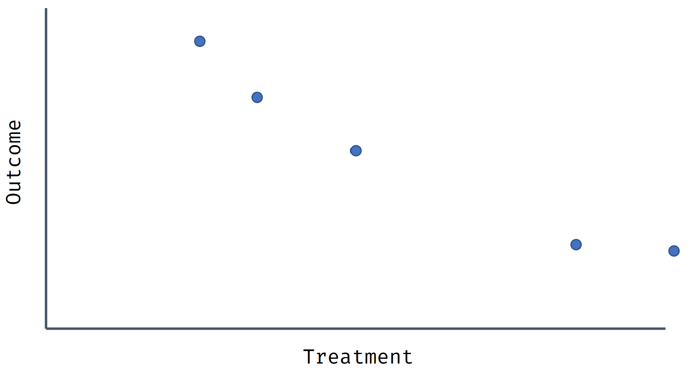


---

<br>
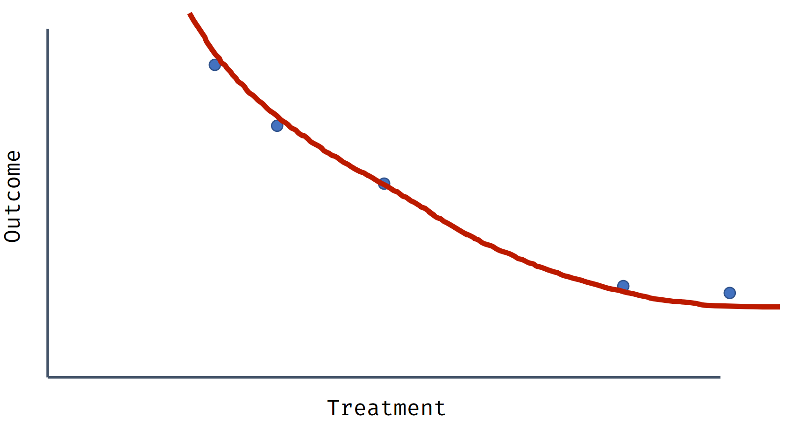


---

<br>
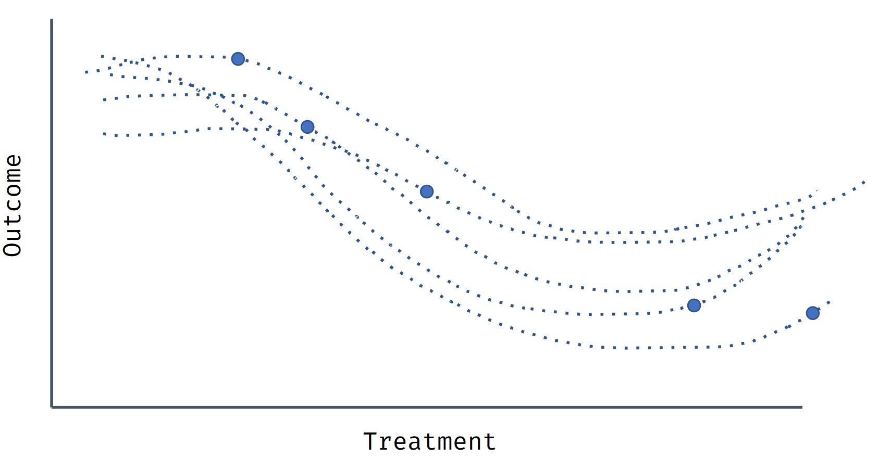


---

<br>
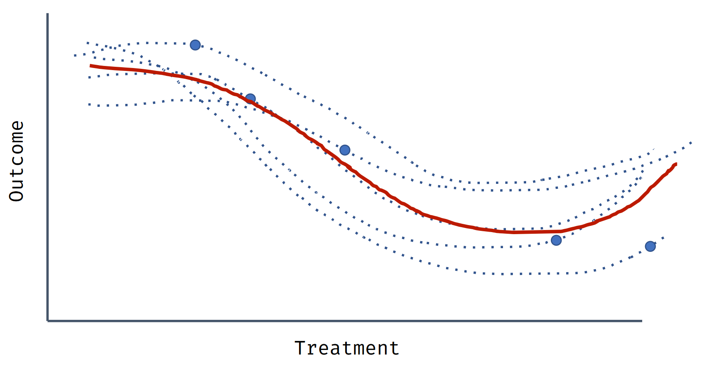


---
layout: center
---

# A brief tour of `DoWhy` and `tfp-causalimpact`

---

# What is DoWhy?

**DoWhy** is a Python library for causal inference that provides a unified interface and emphasizes making causal assumptions **explicit**.

<div class="mt-8">


```mermaid
%%{init: {'theme':'base', 'themeVariables': { 'primaryColor':'#e3f2fd','primaryTextColor':'#0d47a1','primaryBorderColor':'#1976d2','lineColor':'#42a5f5','secondaryColor':'#fff3e0','tertiaryColor':'#f3e5f5','fontFamily':'Fira Code, monospace'}, 'flowchart': {'htmlLabels': true, 'useMaxWidth': true}}}%%
graph LR
    S1["<div style='text-align:center;font-family:Fira Code,monospace'>1. Model</div>"]:::step
    S2["<div style='text-align:center;font-family:Fira Code,monospace'>2. Identify</div>"]:::step
    S3["<div style='text-align:center;font-family:Fira Code,monospace'>3. Estimate</div>"]:::step
    S4["<div style='text-align:center;font-family:Fira Code,monospace'>4. Refute</div>"]:::step

    S1 --> S2 --> S3 --> S4

    classDef step fill:#e3f2fd,stroke:#1976d2,stroke-width:3px,color:#0d47a1,rx:15,ry:15
    linkStyle default stroke:#42a5f5,stroke-width:3px
```

</div>

---

# DoWhy Scenario: Workplace Wellness Program

<div class="mt-4">

Your company launched a voluntary wellness program. **Does participation actually improve employee health?**

| Variable | Description |
|----------|-------------|
| `wellness_program` | 1 if employee participated, 0 otherwise |
| `health_score_change` | Health score change over 6 months |
| `age` | Employee age in years |
| `initial_health` | Initial health score (0-100) |
| `job_stress` | Job stress level (1-10) |
| `tenure` | Years at the company |

</div>

---
layout: two-cols
---

# Step 1: Model (Make assumptions explicit with a causal graph)


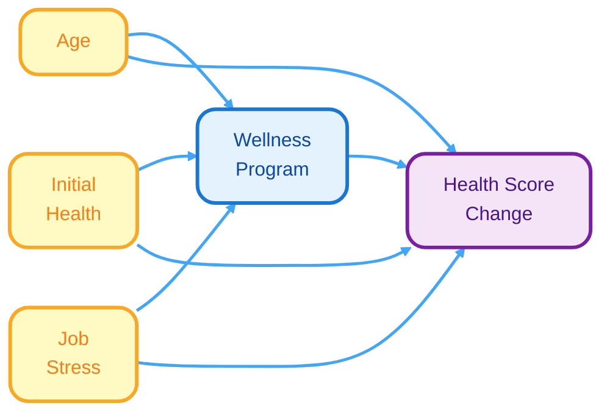
```mermaid
%%{init: {'theme':'base', 'themeVariables': { 'fontFamily':'Fira Code, monospace'}, 'flowchart': {'htmlLabels': true, 'useMaxWidth': true}}}%%
graph LR
    A[Age]:::conf
    IH[Initial<br/>Health]:::conf
    JS[Job<br/>Stress]:::conf
    WP[Wellness<br/>Program]:::treat
    HC[Health Score<br/>Change]:::out

    A --> WP
    A --> HC
    IH --> WP
    IH --> HC
    JS --> WP
    JS --> HC
    WP --> HC

    classDef conf fill:#fff9c4,stroke:#f9a825,stroke-width:3px,color:#f57f17,rx:15,ry:15
    classDef treat fill:#e3f2fd,stroke:#1976d2,stroke-width:3px,color:#0d47a1,rx:15,ry:15
    classDef out fill:#f3e5f5,stroke:#7b1fa2,stroke-width:3px,color:#4a148c,rx:15,ry:15

    linkStyle default stroke:#42a5f5,stroke-width:2.5px
```

::right::

<div class="mt-16">

**Confounders we identified:**

<br>

- • **Age** — affects who joins the program AND health outcomes
- • **Initial Health** — healthier people more likely to join AND to improve
- • **Job Stress** — high-stress employees less likely to join AND improve less

<br>

</div>

---

# DoWhy CausalModel API

In DoWhy, you specify the graph and let it handle the rest:

```python
from dowhy import CausalModel

causal_graph = """
digraph {
    age -> wellness_program;  age -> health_score_change;
    initial_health -> wellness_program;
    initial_health -> health_score_change;
    job_stress -> wellness_program;
    job_stress -> health_score_change;
    wellness_program -> health_score_change;
}
"""

model = CausalModel(
    data=data,
    treatment='wellness_program',
    outcome='health_score_change',
    graph=causal_graph
)
```

<v-click>

<div class="mt-6 text-center">

The causation graph is the **single most important input**. Spend time getting it right!

</div>

</v-click>

---

# Step 2: Identify — Graph-Based Criteria

<style>
.smaller-text p, .smaller-text div, .smaller-text li {
  font-size: 1.1rem !important;
}
</style>

```python
identified_estimand = model.identify_effect(
    proceed_when_unidentifiable=True
)
print(identified_estimand)
```

<div class="mt-4 smaller-text">


<div class="mt-2">
To get the causal effect, adjust for age, initial_health, and job_stress — matches the DAG!
</div>

</div>

---

# Step 3: Estimate — Multiple Methods Available

```python
# Linear regression (backdoor adjustment)
estimate_lr = model.estimate_effect(
    identified_estimand,
    method_name="backdoor.linear_regression",
    test_significance=True
)
```

<div class="mt-4">

**There are many built-in estimation methods available**

</div>

---

# Step 3: Comparing Estimates

<div class="mt-4">

For our wellness program (true effect = **5.0**):

| Method | Estimated Effect |
|--------|-----------------|
| Linear Regression | ~5.0 |
| Propensity Score Matching | ~5.0 |
| Propensity Score Stratification | ~5.0 |

</div>

<br>

Try multiple methods — if estimates agree, you have more confidence in your results!

---

# Step 4: Refute — Test Your Estimate's Robustness

**This is where DoWhy really shines!** Refutation tests check whether your causal assumptions hold by stress-testing the estimate:

<br>

```python
# Add a random confounder — the estimate should stay stable
model.refute_estimate(estimand, estimate,
    method_name="random_common_cause")
```
<br>
If your estimate survives these tests, you can be more confident it's not driven by unobserved confounding or spurious correlation.

---

# DoWhy vs. Manual Approach (Notebook 2)

<div class="grid grid-cols-2 gap-8 mt-8">

<div>

### Notebook 2 (Manual)
- Manually specified confounders
- Built predictive model by hand
- Made counterfactual predictions
- **No formal validation framework**

</div>

<div>

### Notebook 3 (DoWhy)
- Causal graph makes assumptions **explicit & visual**
- Identification uses **formal graph theory**
- Multiple estimation methods with **consistent interface**
- **Refutation tests** validate assumptions

</div>

</div>

<div class="mt-8 text-center">

DoWhy doesn't replace domain knowledge — you still need the right causal graph. But it provides a **principled framework** for the entire workflow.

</div>

---

# DoWhy: Key Takeaways

- • The **causal graph** is critical — spend time thinking through it with domain experts
- • DoWhy's **4-step framework** (Model → Identify → Estimate → Refute) formalizes best practices
- • Try **multiple estimation methods** to check robustness of results
- • **Always run refutation tests** before making strong causal claims
- • If refutations fail, your assumptions are likely wrong — revisit the DAG
- • Be humble: causal inference is powerful but rests on **untestable assumptions**

---

# What is tfp-causalimpact?

**tfp-causalimpact** is a Python package for **time series causal inference** using Bayesian structural time series models.

<div class="mt-8">

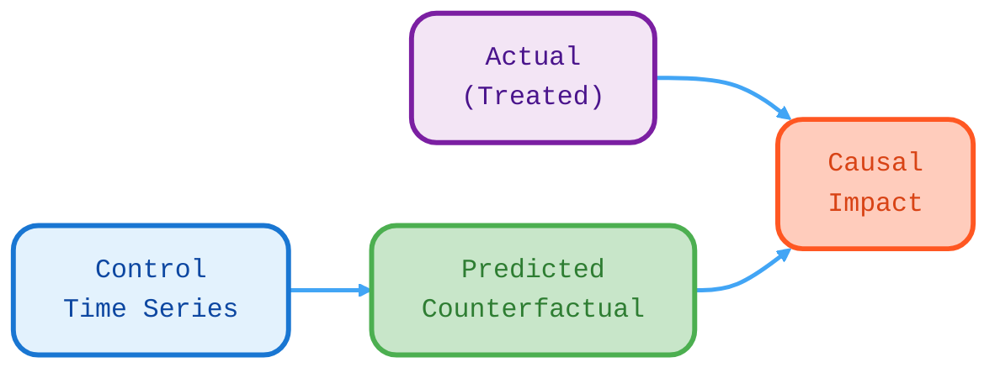
```mermaid
%%{init: {'theme':'base', 'themeVariables': { 'primaryColor':'#e3f2fd','primaryTextColor':'#0d47a1','primaryBorderColor':'#1976d2','lineColor':'#42a5f5','secondaryColor':'#fff3e0','tertiaryColor':'#f3e5f5','fontFamily':'Fira Code, monospace'}, 'flowchart': {'htmlLabels': true, 'useMaxWidth': true}}}%%
graph LR
    C["<div style='text-align:center;font-family:Fira Code,monospace'>Control<br/>Time Series</div>"]:::control
    P["<div style='text-align:center;font-family:Fira Code,monospace'>Predicted<br/>Counterfactual</div>"]:::pred
    A["<div style='text-align:center;font-family:Fira Code,monospace'>Actual<br/>(Treated)</div>"]:::actual
    I["<div style='text-align:center;font-family:Fira Code,monospace'>Causal<br/>Impact</div>"]:::impact

    C --> P
    A --> I
    P --> I

    classDef control fill:#e3f2fd,stroke:#1976d2,stroke-width:3px,color:#0d47a1,rx:15,ry:15
    classDef pred fill:#c8e6c9,stroke:#4caf50,stroke-width:3px,color:#2e7d32,rx:15,ry:15
    classDef actual fill:#f3e5f5,stroke:#7b1fa2,stroke-width:3px,color:#4a148c,rx:15,ry:15
    classDef impact fill:#ffccbc,stroke:#ff5722,stroke-width:3px,color:#d84315,rx:15,ry:15

    linkStyle default stroke:#42a5f5,stroke-width:2.5px
```

</div>

<div class="mt-8 text-center">

**Key idea:** Use control time series to predict what *would have happened* without the intervention. The difference between prediction and reality is the causal impact.

</div>

---

# When to Use CausalImpact

<div class="grid grid-cols-2 gap-8 mt-8">

<div>

### ✅ Ideal When
- You have **time series data** (measurements over time)
- There's a **clear intervention point**
- You have **control series** unaffected by the intervention
- You **can't run an experiment** (intervention already happened)

</div>

<div>

### ❌ Not Suitable When
- Cross-sectional data (no time dimension)
- No control series available
- The intervention affected the controls too
- Intervention timing is unclear

</div>

</div>

<div class="mt-8">

**Common use cases:** Marketing campaigns, policy changes, product feature launches, pricing changes, regional interventions

</div>

---

# CausalImpact Scenario: E-commerce Campaign

<div class="mt-4">

Your company launched an email campaign on June 1 for US customers. **Did it increase daily sales?**

| Series | Role | Description |
|--------|------|-------------|
| `us_sales` | **Treated** | Daily US sales (received campaign) |
| `canada_sales` | Control | Daily Canada sales (no campaign) |
| `uk_sales` | Control | Daily UK sales (no campaign) |
| `traffic` | Control | Daily website traffic |

<br>

<div class="text-center">

**The core assumption:** control series help predict what US sales *would have been* without the campaign.

</div>

</div>

---

# Defining Pre and Post Periods

```python
from causalimpact import fit_causalimpact

# 90 days of data, campaign starts day 61
pre_period  = [data.index[0],  data.index[59]]   # Days 1–60
post_period = [data.index[60], data.index[89]]   # Days 61–90
```

<div class="mt-8">

| Phase | Duration | Purpose |
|-------|----------|---------|
| **Pre-period** | Before intervention | Learn relationship between treated & control series |
| **Post-period** | After intervention | Measure the causal effect |

</div>

---

# Fitting the Model

```python
# Data: first column = treated, remaining = controls
impact = fit_causalimpact(data, pre_period, post_period)

print(summary(impact))
```

<div class="mt-4">

**The model uses a Bayesian structural time series approach** that captures:

- • **Trends** — gradual changes over time
- • **Seasonality** — recurring patterns (weekly, monthly, etc.)
- • **Covariate relationships** — how control series predict the treated series

It learns these patterns from the pre-period, then predicts the counterfactual for the post-period.

</div>

---

# Interpreting the Summary Output

<div class="mt-4">

```
Posterior Inference {Causal Impact}
  Average           Actual     Pred (s.d.)   95% CI
  --------------------------------------------------
  Average           3910       3705 (28)     [3652, 3759]
  Absolute effect    +205       200 (28)     [150, 258]
  Relative effect   +5.5%        5.4%
  --------------------------------------------------
  Posterior tail-area probability p:   0.0003
  Posterior prob. of causal effect:  99.97%
```

</div>

<div class="mt-4">

- **Absolute effect ~200**: The campaign boosted daily sales by ~$200
- **Posterior prob. 99.97%**: Extremely high confidence the effect is real
- **Tail-area probability p ≈ 0**: Effect is statistically significant

</div>

---

# Visualizing Results

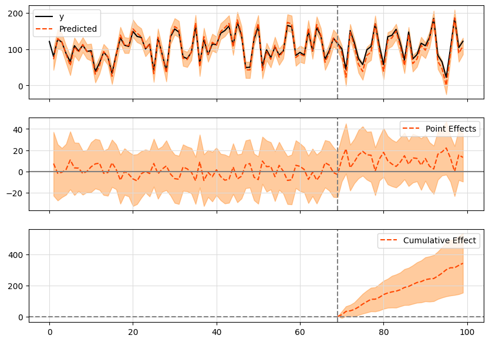

<div class="text-center mt-4">

**Three panels:** Original data (top), Pointwise effect (middle), Cumulative effect (bottom)

</div>

---

# CausalImpact: Important Assumptions

<div class="mt-8">

1. **Controls are unaffected by the intervention**
   - The treatment must not "spill over" to your control series
   - Example: if your campaign targeted all of North America, Canada sales aren't a valid control

2. **Stable relationship before and after**
   - The relationship between treated and control series should be the same pre and post (except for the intervention effect)

3. **Sufficient pre-intervention data**
   - You need enough data to learn the predictive relationship
   - A good rule: at least 2-3 cycles of any seasonal pattern

</div>

---

# CausalImpact vs. Other Approaches

<div class="mt-8">

| Method | Data Type | Key Idea |
|--------|-----------|----------|
| **Causal Graphs** (Notebook 1) | Cross-sectional | Think through confounding structure |
| **S-Learner** (Notebook 2) | Cross-sectional | ML model predicts counterfactuals |
| **DoWhy** (Notebook 3) | Cross-sectional | Formal 4-step framework with refutation |
| **CausalImpact** (Notebook 4) | **Time series** | Bayesian structural time series with controls |

</div>

<div class="mt-8 text-center">

Each tool has its place — **match the method to your data structure and research question!**

</div>

---

# tfp-causalimpact: Key Takeaways

- • Ideal for **time series interventions** with clear before/after periods
- • **Control series must not be affected** by the intervention
- • Bayesian approach gives you **credible intervals** and **posterior probabilities**
- • The **cumulative effect** tells you total impact, pointwise shows how it evolves
- • Always **visualize your data** before and after the intervention
- • **Good control series** are essential — spend time selecting them carefully

---
layout: center
---

# Closing Thoughts

---

# The Perils of Multiple Testing

<div class="mt-8">

Running many statistical tests inflates your false positive rate!

<br>
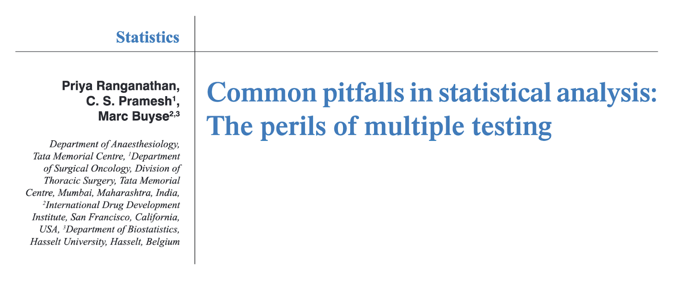

</div>

---

# Be Humble!

<div class="text-center mt-8">

It's likely your research or business idea doesn't work!

<br>
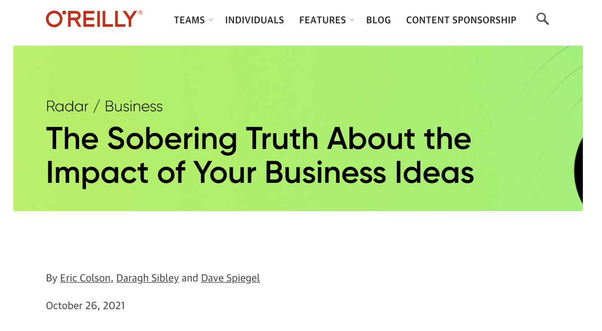


</div>

---

# Troubleshooting Tips

- • Having **domain knowledge** and understanding the data-generating process is often way more productive than just throwing an algo at the problem
- • There is value in trying **multiple techniques** to understand their range of estimates (but use p-value correction!)
- • You'll **never capture all confounders**, but do aim to capture the major ones
- • If your results don't make sense and your code isn't buggy, you're probably **missing a big source of bias**
- • Causal inference is powerful but **still not as trustworthy as running a proper experiment**. Approach all results with healthy skepticism.

---
layout: center
class: text-center
---

# Thank You! 🎉

### Questions?

<div class="mt-8">
https://github.com/ronikobrosly/scipy_2026_causal_inference_tutorial

</div>
